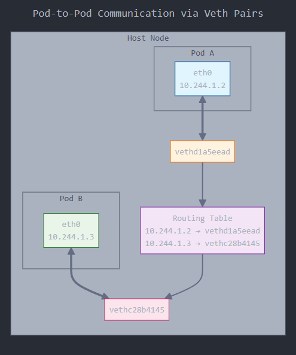
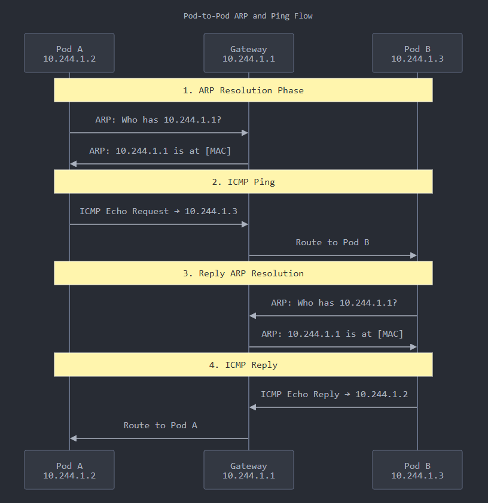
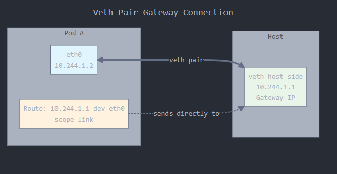
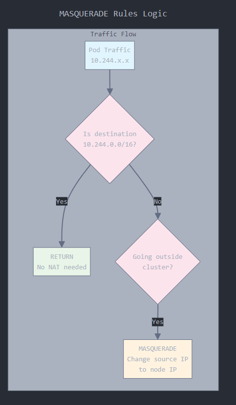

# Inside Intra-Node Pod Traffic in Kubernetes: How Kindnet with PTP Moves Packets

When a pod wants to talk to another pod on the same node, each sends traffic to its gateway (`10.244.X.1`) via `eth0` which resolves to the host-side veth on the same node. The host then routes packets to the peer pod’s veth using static entries in it's routing table. But before that hop, the pod still ARPs for its gateway.

This article traces packets between two pods on the same node using `tshark`, confirms the ARP exchange, inspects the forwarding path through the host’s veth interfaces, and explores how Kindnet achieves L3 routing—*while still relying on ARP resolution on the pod side*.

In the first article, we explored how Kindnet configures pod networking with `ptp`, sets up veth pairs, assigns `/32` host routes, and wires each pod into the host namespace.

Now let's start inspecting traffic between two pods on the same node.

## The Setup: Same-Node Pod Pairs, IPs, and Routes

We’re working in a two-node Minikube cluster with Kindnet as the CNI, using the default `ptp` plugin. Let’s confirm that our two pods—Pod A and Pod B—are scheduled onto the same node, and retrieve their IPs.

```bash
kubectl get pods -o wide | grep pod-to-pod

pod-to-pod-6d4875f88c-5qcw5   10.244.1.2   minikube-m02
pod-to-pod-6d4875f88c-99qwj   10.244.1.3   minikube-m02
```

Both pods land on `minikube-m02`. Their IPs are in the same PodCIDR assigned to that node (`10.244.1.0/24`), and Kindnet has installed per-pod `/32` host routes for them.

On the host run the following to explore the forwarding path:

```bash
minikube ssh -n minikube-m02
ip route | grep 10.244.1

10.244.1.2 dev vethd1a5eead scope host 
10.244.1.3 dev vethc28b4145 scope host
```

Traffic destined for `10.244.1.3` will be routed via `vethc28b4145` as it is the host-side veth paired with Pod B’s `eth0`.



Now we’ll trace what actually happens when Pod A sends traffic to Pod B on the same node.

## Capture ARP and ICMP Traffic from Pod A to Pod B

Before we send any pings, we’ll clear the ARP cache inside Pod A to force a fresh request. Inside Pod A:

```bash
kubectl exec -it pod-to-pod-6d4875f88c-5qcw5 -- ip neigh flush all
```

We already identified that `vethc28b4145` is the host-side veth connected to Pod B (`10.244.1.3`). From the host (`minikube-m02`), start a packet capture on that interface:

```bash
sudo tshark -i vethc28b4145 -f "icmp or arp"
```

Leave this running. In a second terminal, trigger the packet flow from Pod A (`10.244.1.2`) to Pod B:

```bash
kubectl exec -it pod-to-pod-6d4875f88c-5qcw5 -- ping -c1 10.244.1.3

1 packets transmitted, 1 received, 0% packet loss, time 0ms
rtt min/avg/max/mdev = 0.121/0.121/0.121/0.000 ms
```

Now switch back to your `tshark` capture. You should see output like this:

```text
8a:21:03:db:fe:11 → ff:ff:ff:ff:ff:ff ARP Who has 10.244.1.3? Tell 10.244.1.1
6a:9e:4f:c8:4e:83 → 8a:21:03:db:fe:11 ARP 10.244.1.3 is at 6a:9e:4f:c8:4e:83

10.244.1.2 → 10.244.1.3 ICMP Echo request
10.244.1.3 → 10.244.1.2 ICMP Echo reply

6a:9e:4f:c8:4e:83 → ff:ff:ff:ff:ff:ff ARP Who has 10.244.1.1? Tell 10.244.1.3
8a:21:03:db:fe:11 → 6a:9e:4f:c8:4e:83 ARP 10.244.1.1 is at 8a:21:03:db:fe:11
```

Before Pod A can send any packet like ping, it must know the MAC address of its next hop, which is `10.244.1.1`. That IP isn’t Pod B—it’s the gateway IP on the other end of the veth pair inside the host. So Pod A issues an ARP request for `10.244.1.1` to figure out what Ethernet address to send the packet to.

The packet exits Pod A and enters the host through its veth. The host routes it to Pod B using a `/32` rule that maps `10.244.1.3` directly to `vethc28b4145`. Pod B receives the packet, and when preparing the reply, it consults its routing table—default via `10.244.1.1`.

Pod B doesn't send the reply directly to Pod A’s IP. Just like Pod A, it always routes through its gateway. So it uses `10.244.1.1` as its next-hop gateway. But before sending the ICMP reply, it ARPs to resolve the MAC address of `10.244.1.1` too.



## Inspect Routing and Neighbor Tables Inside Each Pod

We’ve seen the packets on the wire. Now let’s inspect the control plane: how each pod understands where to send traffic and which MACs it has learned.

Start with **Pod A** (`10.244.1.2`). Check its routing table:

```bash
kubectl exec -it pod-to-pod-6d4875f88c-5qcw5 -- ip route

default via 10.244.1.1 dev eth0 
10.244.1.0/24 via 10.244.1.1 dev eth0 src 10.244.1.2 
10.244.1.1 dev eth0 scope link src 10.244.1.2 
```

All traffic—including packets to other pods on the same subnet—is sent to `10.244.1.1`, the pod’s declared gateway. This IP is assigned to the host-side veth and acts as the entry point into the node’s routing stack. The pod doesn’t interact with peers directly; it always sends to the gateway. How does the pod know where to send it?

The last route—`10.244.1.1 dev eth0 scope link`—tells the pod **send packets to `10.244.1.1` directly out `eth0`—it is the other end of the veth pair.**



Now check the neighbor table (ARP cache):

```bash
kubectl exec -it pod-to-pod-6d4875f88c-5qcw5 -- ip neigh

10.244.1.1 dev eth0 lladdr 72:b5:bb:06:6f:1d STALE
```

The pod has learned the MAC address of its gateway on interface `eth0`, but hasn’t used it recently. No MAC for Pod B—because Pod A never sends directly to it.

Now flip to **Pod B** (`10.244.1.3`) and run the same commands:

```bash
kubectl exec -it pod-to-pod-6d4875f88c-99qwj -- ip route

default via 10.244.1.1 dev eth0
10.244.1.0/24 via 10.244.1.1 dev eth0 src 10.244.1.3
10.244.1.1 dev eth0 scope link src 10.244.1.3

kubectl exec -it pod-to-pod-6d4875f88c-99qwj -- ip neigh

10.244.1.1 dev eth0 lladdr 8a:21:03:db:fe:11 STALE
```

Same behavior: each pod talks only to `10.244.1.1`. There is no peer-to-peer ARP—because only the host sees both pods, the pods never see each other directly.

## Trace Host Routing Decisions with `ip route get`

We’ve confirmed that pods send traffic to their gateway, now let’s explore what the host does when it receives that packet.

We’ll ask the kernel: “If I send a packet to this IP, what interface and next hop will you use?”

```bash
minikube ssh -n minikube-m02

ip route get 10.244.1.3

10.244.1.3 dev vethc28b4145 src 10.244.1.1 uid 1000 
    cache
```

The host routes `10.244.1.3` via `vethc28b4145`—the exact interface we captured earlier. The `src` is `10.244.1.1`, meaning the reply will appear to come from the gateway IP. Finally, the decision is cached, so the kernel won’t recalculate it unless needed.

## Is SNAT Touching Node-Local Pod Traffic?

We’ve validated that intra-node pod traffic flows through veth pairs, is routed via static `/32` rules (in `ptp`) or switches through a bridge (in `bridge`), and relies on ARP when appropriate. But there’s one last piece to verify: **does Kubernetes ever apply SNAT to pod-to-pod traffic, even when both pods are on the same node?**

Let’s inspect what iptables is doing to traffic on this node. SSH into the node and dump the MASQUERADE rules:

```bash
minikube ssh -n minikube-m02
sudo iptables -t nat -L -n -v | grep MASQUERADE

MASQUERADE  all  --  *     !docker0  172.17.0.0/16  0.0.0.0/0           
RETURN      all  --  *     *         0.0.0.0/0      10.244.0.0/16  /* kind-masq-agent: local traffic is not subject to MASQUERADE */
MASQUERADE  all  --  *     *         0.0.0.0/0      0.0.0.0/0      /* kind-masq-agent: outbound traffic is subject to MASQUERADE (must be last in chain) */
```

Let’s go through these, line by line.

The first one is Docker-specific. It says: if traffic is from `172.17.0.0/16` and **not leaving through `docker0`**, apply SNAT. This is irrelevant for pod traffic, but still active on the node.

The second line says if the destination is inside the pod network (10.244.0.0/16), don't SNAT. This is why **no source IP rewrite** happens when one pod talks to another directly by IP.

The third line is the **default SNAT** rule for all **outbound** traffic. If the packet didn’t match any earlier rule, and it's leaving the node—**this rule kicks in and rewrites the source IP.**



## Prove SNAT Does Not Apply to Direct Pod-to-Pod Traffic

We’ve already seen that the iptables `RETURN` rule excludes traffic within the pod CIDR (`10.244.0.0/16`) from SNAT. Let’s confirm that with a live packet capture—on a pod on the same node. We’ll watch what **Pod B** (`10.244.1.3`) sees when pinged by **Pod A** (`10.244.1.2`). First, open a shell into Pod B and start sniffing:

```bash
kubectl exec -it pod-to-pod-6d4875f88c-4d5wh -- tshark -i eth0
```

Now, from Pod A (`10.244.1.2`), send a single ICMP packet to Pod B:

```bash
kubectl exec -it pod-to-pod-6d4875f88c-tj72k -- ping -c1 10.244.1.3
```

Now back in the tshark trace inside Pod B, you should see:

```text
1 0.000000000   10.244.1.2 → 10.244.1.3   ICMP Echo request
2 0.000063461   10.244.1.3 → 10.244.1.2   ICMP Echo reply
```

The packet **arrives with Pod A’s real IP: `10.244.1.2`** which means that the source IP is preserved.

## Kindnet with ptp Key Takeaways

Pod A sends to Pod B's IP, but always **routes the packet to its gateway**—`10.244.X.1`—not directly to the peer.

That “gateway” is just the **host-side veth** on the other end of the pod’s veth pair—**not a real router**.

Each pod does an **ARP for `10.244.X.1`**, even if the destination pod is on the same node and same subnet.

The host (Minikube node) sees **/32 static routes** injected by Kindnet that map pod IPs to their respective veth interfaces. So when the packet hits the host, the kernel matches the `/32` route and forwards the packet to the peer pod’s veth.

**Neither pod ever ARPs for the other.**, they only see the gateway.

SNAT is bypassed because iptables has a `RETURN` rule for traffic staying within the pod CIDR.

## Next: What If the Pods Are On Different Nodes?

Now that we’ve explored intra-node traffic, the next logical step is to go cross-node.

⬅️ Previously: **Inside a Pod’s Birth: Veth Pairs, IPAM, and Routing with Kindnet CNI** where we teardown veth pairs, `/32` routes, and how `ptp` links pods to the host.

➡️ Up next: **Inter-Node Pod Traffic with Kindnet: The No-Overlay Walkthrough** where we’ll trace packets as they leave one node and arrive on another using static `/24` routes.

## References

- https://github.com/kubernetes-sigs/kind/issues/2444
- https://www.tkng.io/cni/kindnet/
- https://kubernetes.io/docs/concepts/cluster-administration/networking/
- https://github.com/containernetworking/cni/blob/main/SPEC.md
- https://github.com/kubernetes-sigs/kind/tree/main/images/kindnetd
- https://github.com/kubernetes-sigs/kind/issues/2444
- https://man7.org/linux/man-pages/man8/ip-route.8.html
- https://man7.org/linux/man-pages/man8/ip-neigh.8.html
- https://man7.org/linux/man-pages/man8/iptables.8.html
- https://wiki.wireshark.org/CaptureSetup/Linux
- https://github.com/containernetworking/plugins/tree/main/plugins/main/ptp
- https://github.com/kubernetes/kubernetes/blob/master/pkg/kubelet/dockershim/network/cni/cni.go