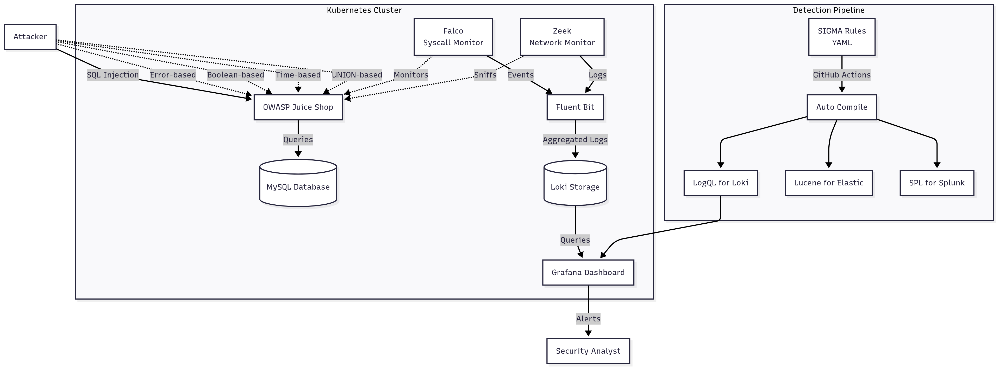
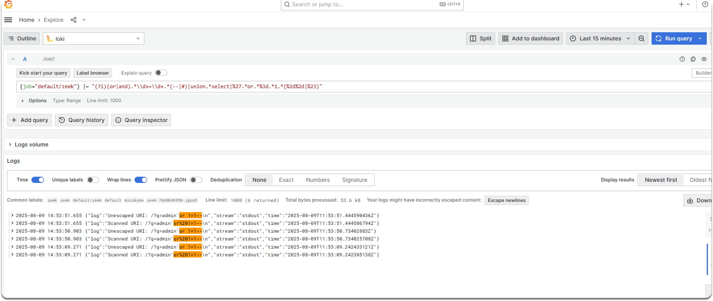
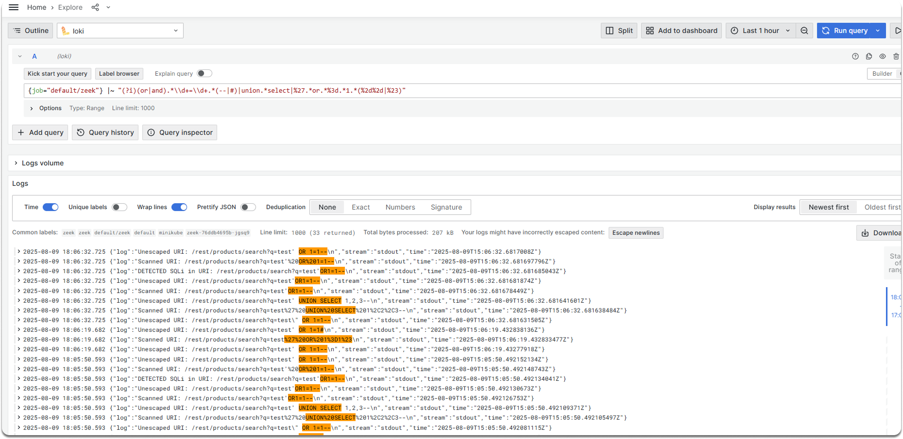

---
myst:
  html_meta:
    "description lang=en": "Scale your detection logic with Sigma rules that work across multiple SIEM platforms. Convert lab-tested SQL injection detection into portable, version-controlled rules that compile to LogQL, Lucene, and SPL. Implement detection-as-code with automated testing and cross-platform deployment."
    "keywords": "SQL injection detection, security lab automation, Kubernetes security monitoring, detection engineering, cybersecurity training, hands-on security, SIEM integration, container security, threat hunting, security observability, Docker MySQL PHP, OWASP Juice Shop, Falco Zeek Loki, Sigma rules, multi-platform detection, GitOps security""
    "property=og:locale": "en_US"
    "property=og:type" : "article"
    "property=og:title" : "Time, Errors, and Unions: Practical SQL Injection Exploitation and Detection"
    "property=og:image": "https://raw.githubusercontent.com/colossus06/PodLock-Blog/main/og/sigma.png"
---


(sigma)=
# SQL Injection Detection with Sigma on Kubernetes

In the earlier parts of this series, we built a controlled SQL injection lab with Docker and PHP, then deployed OWASP Juice Shop on Minikube with Falco, Zeek, and Loki to capture attacks in real time. We started with basic string matching and log aggregation to catch common SQL injection patterns.

In a production SOC, these same detections must work across multiple platforms, handle enterprise-scale log volumes, and integrate cleanly into the existing security stack. Relying on raw string matching quickly becomes unmanageable when logs come in varied formats, attackers change tactics, and teams need to maintain hundreds of rules over time.

Our goal in this stage is to take what worked in the lab and make it portable. That means a single rule definition that we can run on Loki today, and tomorrow in Elastic or Splunk, without rewriting the logic for each backend.



## SIGMA Rules for Cross-Platform Detection

Sigma gives us that portability.

It defines detection logic in a backend-agnostic YAML format, then compiles it into the native query language of any supported platform.

In the lab, our detection logic was just a Zeek script with a regex for the tautology `or 1=1--`.

It worked for the demo, but it would fail in production against mixed-case keywords, inline comments, URL encoding, or other evasion techniques.

We need a detection rule that accounts for these variations while staying maintainable.

Sigma handles this by grouping related attack variants into selections.

The rule can trigger if any one selection matches, allowing us to keep the regexes small and focused while covering a broad set of patterns.

The example below includes tautology-based injections, UNION-based queries, inline comment obfuscations, and URL-encoded forms of each. We match both query strings (`cs_uri_query`) and request bodies (`sc_content`) so the detection works for GET and POST requests.

```yaml
...
tags:
  - attack.initial_access
  - attack.t1190
logsource:
  category: webserver
  product: "*"

detection:
  q_tautology:
    cs_uri_query|re: (?i)(or|and)\s*['"]?\s*\d+\s*=\s*\d+.*(?:--|#|/\*)
  q_union:
    cs_uri_query|re: (?i)['"]?\s*union\s+(?:all\s+)?select\b
  q_urlenc_tautology:
    cs_uri_query|re: (?i)(%27|')\s*(or|and)\s*1\s*(%3d|=)\s*1.*(%2d%2d|%23)

  b_tautology:
    sc_content|re: (?i)(or|and)\s*['"]?\s*\d+\s*=\s*\d+.*(?:--|#|/\*)
  b_union:
    sc_content|re: (?i)['"]?\s*union\s+(?:all\s+)?select\b
  b_urlenc_tautology:
    sc_content|re: (?i)(%27|')\s*(or|and)\s*1\s*(%3d|=)\s*1.*(%2d%2d|%23)

  condition: 1 of q_* or 1 of b_*
```

The `condition` line keeps the rule concise—matching on any one selection triggers the alert.

With the YAML in place, we can compile it for any backend.

For Elasticsearch with ECS-mapped Zeek logs, that means installing the Lucene backend and selecting the matching pipeline:

```bash
source ../venv/bin/activate
pip install pysigma-backend-elasticsearch
sigma list pipelines lucene
sigma convert -t lucene -p ecs_zeek_beats sigma-sqli-detection-pipeline.yaml
```

The result is a native Lucene query targeting fields like `url.query` and `http.request.body.content`, ready to run in Kibana.

The detection logic hasn’t changed—only the syntax has.

We can repeat the process for Loki:

```bash
sigma convert -t loki sigma-sqli-detection-pipeline.yaml
```

This produces a LogQL expression with the same matching logic, now ready to query our Zeek logs:

```text
{job=~".+"} | logfmt | cs_uri_query=~`(?i)(or|and)\s*['"]?\s*\d+\s*=\s*\d+.*(?:--|#|/\*)` or cs_uri_query=~`(?i)['"]?\s*union\s+(?:all\s+)?select\b` or cs_uri_query=~`(?i)(%27|')\s*(or|and)\s*1\s*(%3d|=)\s*1.*(%2d%2d|%23)` or sc_content=~`(?i)(or|and)\s*['"]?\s*\d+\s*=\s*\d+.*(?:--|#|/\*)` or sc_content=~`(?i)['"]?\s*union\s+(?:all\s+)?select\b` or sc_content=~`(?i)(%27|')\s*(or|and)\s*1\s*(%3d|=)\s*1.*(%2d%2d|%23)`
```

At this stage, we have a single Sigma YAML file that can generate platform-native queries for both Loki and Elasticsearch without modifying the detection logic. The next step is to confirm it works against real traffic coming from our lab environment.

### Validating Detection in Loki

We begin with a baseline tautology injection to confirm the rule triggers on the most common SQL injection pattern:

```bash
curl -s "http://192.168.49.2:30602/rest/products/search?q=test' OR 1=1--"
```

Next, we send the same injection URL-encoded to check that the rule catches encoded variants and not just raw payloads:

```bash
curl -s "http://192.168.49.2:30602/rest/products/search?q=test%27%20OR%201%3d1--"
```

Zeek parses both requests, applies our detection regex, and logs matching events to stdout.

We can then pivot to Grafana, using the Loki data source we configured earlier, and run a query that filters only the detection events:

```logql
{job="default/zeek"} |~ "(?i)(or|and).*\\d+=\\d+.*(--|#)|union.*select|%27.*or.*%3d.*1.*(%2d%2d|%23)"
```

The output confirms that both the raw and encoded payloads were successfully detected:

```json
{"log":"Unescaped URI: /?q=admin'or 1=1--\n","stream":"stdout","time":"2025-08-09T11:53:51.444590436Z"}
{"log":"Scanned URI: /?q=admin'or%201=1--\n","stream":"stdout","time":"2025-08-09T11:53:51.444586794Z"}
```



With this validation in place, we know the same detection logic can run in multiple backends and still catch real attack traffic. From here, we can expand coverage to more payload families while keeping the Sigma YAML as our single source of truth.

### Operationalizing Detection-as-Code

Once we have confidence in the translation process, we store the Sigma YAML in Git alongside other detection content. This lets every change be reviewed, versioned, and tracked.

Our CI/CD pipeline then compiles the rule into all supported backends—Loki, Elasticsearch, Splunk—and pushes the generated queries to each environment. If we ever need to roll back, we can revert to a known-good commit and redeploy across every backend in one step.

### Tuning and Validation Workflow

Writing the Sigma rule is the starting point, not the finish line. We need a repeatable process to verify it triggers only on malicious traffic and stays silent on legitimate activity.

We organize known attack payloads and safe requests into separate files so they can be replayed as regression tests.

`payloads/malicious.txt` contains SQL injection techniques we expect to trigger the rule:

```bash
/rest/products/search?q=test' OR 1=1--
/rest/products/search?q=test%27%20OR%201%3d1--
/rest/products/search?q=test' UNION SELECT 1,2,3--
/rest/products/search?q=test' or 1=1#
...
```

`payloads/benign.txt` contains normal queries that should not match:

```bash
/rest/products/search?q=apple
/rest/products/search?q=database%20book
/rest/products/search?q="premium coffee"
/rest/products/search?q=order%20form
```

A simple script replays both sets of payloads against Juice Shop with short delays to give Zeek time to process each request:

```bash
#!/usr/bin/env bash
TARGET="http://192.168.49.2:30602"

echo "[*] Testing malicious payloads..."
while read -r uri; do
  echo "  -> Testing: $uri"
  curl -s "$TARGET$uri" > /dev/null
  sleep 1
done < payloads/malicious.txt

echo "[*] Testing benign payloads..."
while read -r uri; do
  echo "  -> Testing: $uri"
  curl -s "$TARGET$uri" > /dev/null
  sleep 1
done < payloads/benign.txt
```

Running this regression suite gives us immediate feedback on whether the rule is firing exactly where we expect it to. If it flags only the malicious payloads and ignores benign ones, we know our detection logic is behaving correctly.

```bash
./regression.sh
...
[*] Testing malicious payloads...
  -> Testing: /rest/products/search?q=test' OR 1=1--
  -> Testing: /rest/products/search?q=test%27%20OR%201%3d1--
[*] Testing benign payloads...
  -> Testing: /rest/products/search?q=apple
  -> Testing: /rest/products/search?q=database%20book
  -> Testing: /rest/products/search?q=select%20button
  -> Testing: /rest/products/search?q=union%20jack
[*] Tests completed. Check Loki logs in Grafana.
```

We then switch to Grafana Explore and run our compiled LogQL query against the Loki datasource:

```logql
{job="default/zeek"} |~ "(?i)(or|and).*\\d+=\\d+.*(--|#)|union.*select|%27.*or.*%3d.*1.*(%2d%2d|%23)"
```

The results clearly show events for our malicious test cases:

```json
{"log":"Unescaped URI: /rest/products/search?q=test' OR 1=1--\n","stream":"stdout","time":"2025-08-09T15:06:32.6817008Z"}
{"log":"Scanned URI: /rest/products/search?q=test'%20OR%201=1--\n","stream":"stdout","time":"2025-08-09T15:06:32.681697796Z"}
{"log":"DETECTED SQLi in URI: /rest/products/search?q=test'OR1=1--\n","stream":"stdout","time":"2025-08-09T15:06:32.681685043Z"}
```



The absence of any benign payloads in the results confirms the balance we aim for—broad enough to detect real attacks, narrow enough to avoid unnecessary noise.

When we do see false positives, the refinement loop is straightforward. We adjust the regex in the Sigma YAML, recompile it to LogQL, re-run the query, and inspect the results. We repeat until the separation between malicious and legitimate traffic is clear.

Once the detection logic is solid, the next step is making sure that when an alert triggers, the analyst has enough context to act without having to search for it elsewhere.

### Enrichment and Threat Context

Detection without context slows down response. Analysts shouldn’t have to look up what “SQLi detected” means or where it fits in the attack chain. We solve this by embedding enrichment directly into the Sigma YAML.

We add MITRE ATT\&CK mappings, links to relevant attack documentation, and tags from our internal taxonomy. Because this information lives in the YAML, it persists through compilation into every backend—Grafana, Splunk, Elastic—without needing backend-specific rules for enrichment.

```yaml
title: SQL Injection Detection
id: 4f56d76e-59a8-42a0-8d7b-a8d3c1b934b1
description: Detects SQL injection attempts in HTTP requests, including encoded variants
status: experimental
tags:
  - attack.initial_access
  - attack.t1190
  - sql_injection
  - zeek
references:
  - https://owasp.org/www-community/attacks/SQL_Injection
logsource:
  category: webserver
  product: "*"
```

When this rule triggers, the alert already contains the ATT\&CK technique ID, a reference link, and meaningful tags. The analyst can immediately pivot to related detections or incident playbooks without leaving their dashboard. The benefit is consistency—every platform sees the same context because it’s baked into the source rule.

This handles the “what is it?” question, but detection engineering is not static. As attacker behavior changes, our rules need to adapt.

### Extending Coverage

Once the base detection is proven stable, we extend it to include additional SQL injection techniques. Stacked queries, blind boolean-based payloads, and database-specific commands are all candidates for expansion. Sigma’s `condition` structure makes this straightforward: we add new patterns as separate selections, then reference them alongside the existing ones without rewriting the whole rule.

```yaml
q_stacked_queries:
  cs_uri_query|re: (?i);\s*shutdown\b
b_stacked_queries:
  sc_content|re: (?i);\s*shutdown\b
q_blind_boolean:
  cs_uri_query|re: (?i)and\s+\d+\s*=\s*\d+\s+waitfor\s+delay
b_blind_boolean:
  sc_content|re: (?i)and\s+\d+\s*=\s*\d+\s+waitfor\s+delay

condition: 1 of q_* or 1 of b_*
```

By keeping the rule modular, we can push updates through Git and CI/CD just like any other code change. Every backend gets the updated logic automatically, and the detection set grows alongside our threat intelligence.

The existing tautology and UNION checks stay as they are—we simply append more patterns. The `condition` structure already matches `1 of q_* or 1 of b_*`, so scaling the coverage is as simple as defining a new selection.

```yaml
  q_stacked_queries:
    cs_uri_query|re: (?i);\s*shutdown\b
  b_stacked_queries:
    sc_content|re: (?i);\s*shutdown\b
  q_blind_boolean:
    cs_uri_query|re: (?i)and\s+\d+\s*=\s*\d+\s+waitfor\s+delay
  b_blind_boolean:
    sc_content|re: (?i)and\s+\d+\s*=\s*\d+\s+waitfor\s+delay

  condition: 1 of q_* or 1 of b_*
```

This modularity means we can respond to new intelligence without touching the rest of the rule.

And because the Sigma YAML lives in Git, every update flows through the same CI/CD process we use for initial deployment, so every backend stays in sync automatically.

### Final Words

We started with a single Zeek regex, good enough to flag a tautology but too brittle for production. By moving to Sigma, we turned that one-off script into a portable detection artifact that runs in Loki today, could run in Splunk tomorrow, and will survive any backend migration. We embedded analyst context so alerts are meaningful on their own, and we built the rule to scale as new attack patterns emerge.

The result is a maintained, version-controlled, and tested piece of detection logic that behaves like any other code in our stack.

From here, extending this workflow to other attack types is straightforward. The same principles—generic rule logic, metadata for context, automated multi-backend compilation, and continuous validation—apply to XSS, command injection, and beyond.

## Key Takeaways

* A single Sigma YAML file can be compiled to LogQL, Lucene, or SPL without touching the detection logic, ensuring identical behavior across Loki, Elasticsearch, and Splunk.

* Version-controlling Sigma rules in Git enables peer-reviewed changes, full history tracking, and automated backend compilation in CI/CD for consistent multi-platform deployment.

* A regression suite with known malicious payloads and benign traffic validates detection accuracy before production, preventing both false positives and missed attacks.

* Embedding MITRE ATT\&CK IDs, campaign references, and internal taxonomy tags directly in the rule ensures analysts get the same enrichment in every backend without extra configuration.

* Sigma’s `condition` syntax allows incremental coverage expansion—such as adding stacked query or blind injection patterns—without modifying existing tautology or UNION detection logic.

**Enjoyed this read?**

If you found this guide helpful,check our blog archives 📚✨

- Follow me on [LinkedIn](https://www.linkedin.com/in/gulcantopcu/) to get updated.
- Read incredible Kubernetes Stories: [Medium](https://medium.com/@gulcantopcu)
- Challenging projects: You're already in the right place.

Until next time!

