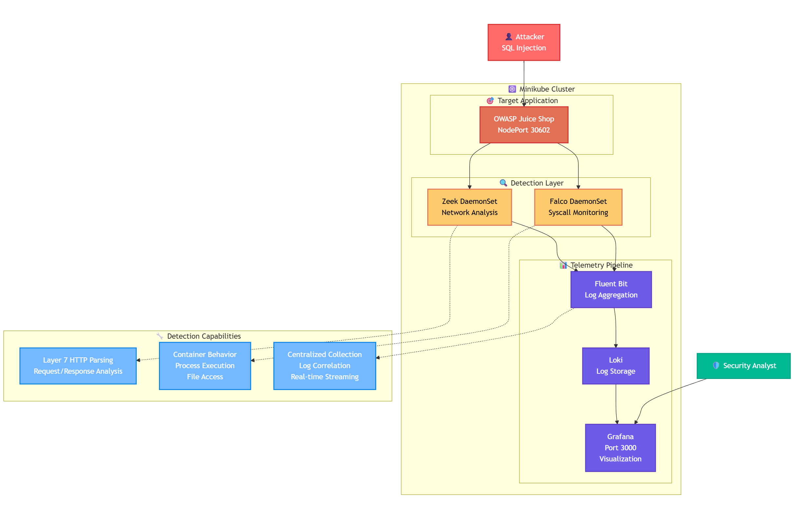
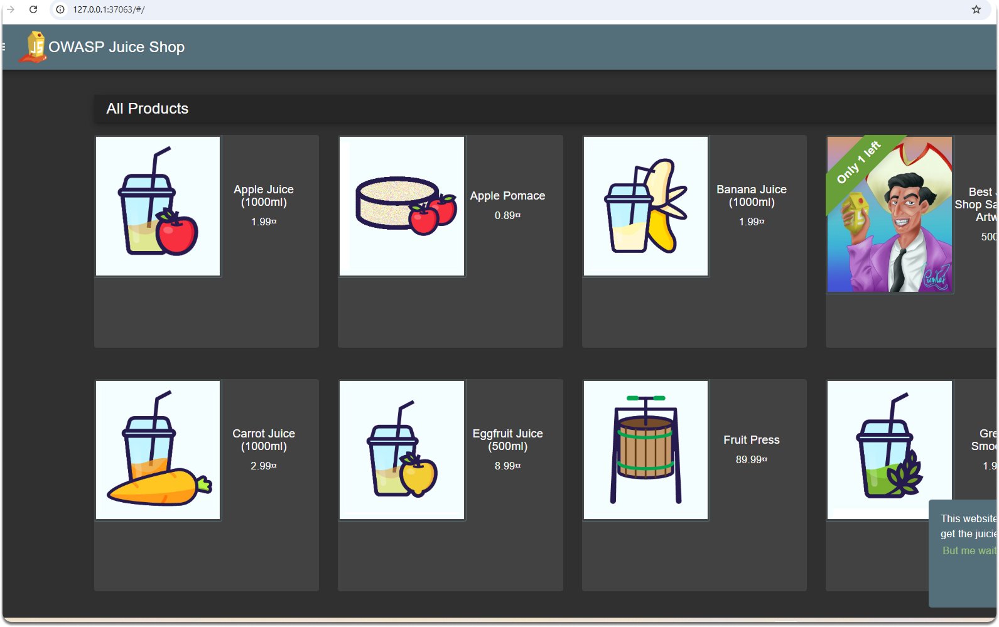
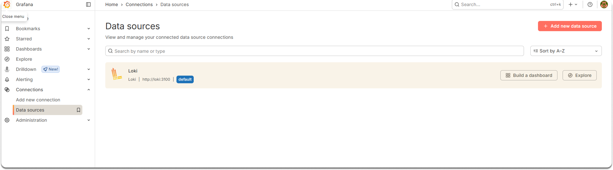
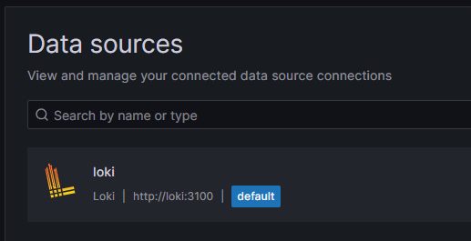
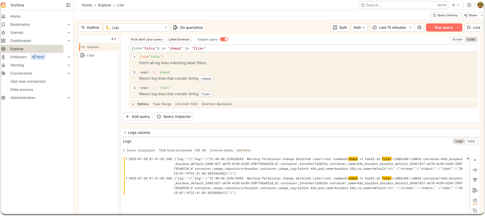
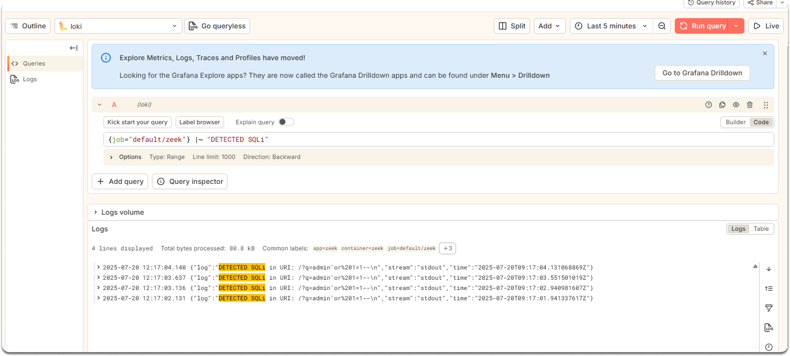

---
myst:
  html_meta:
    "description lang=en": "Deploy OWASP Juice Shop on Kubernetes and build a complete detection pipeline with Falco for syscall monitoring, Zeek for network analysis, and Loki/Grafana for centralized observability. Transform your security lab into a production-ready SOC environment with real-time attack detection."
    "keywords": "Kubernetes security, OWASP Juice Shop, Falco syscall monitoring, Zeek network analysis, SOC lab setup, Fluent Bit log aggregation, Loki Grafana stack, container security monitoring, detection engineering, security observability, Minikube cluster, DaemonSet deployment, eBPF monitoring, Layer 7 traffic analysis, Helm charts installation"
    "property=og:locale": "en_US"
    "property=og:type" : "article"
    "property=og:title" : "Time, Errors, and Unions: Practical SQL Injection Exploitation and Detection"
    "property=og:image": "https://raw.githubusercontent.com/colossus06/PodLock-Blog/main/og/soc.png"
---


(soc)=
# Building a Detection-Ready SOC Lab on Kubernetes: From Pod to Signal

You're reading part 2 of the 3-part SOC detection on Kubernetes with Sigma series:

- [Part 1: Manual SQL injection with Docker, PHP, MySQL - covers error-based, boolean-based, time-based, and UNION techniques](https://podlock.readthedocs.io/blogs/k8s/time/time.html#time)
- [Part 3: Portable SIGMA rules with CI/CD that compile to Loki, Elasticsearch, and Splunk automatically](https://podlock.readthedocs.io/blogs/k8s/sigma/sigma.html)

In the first article, we built a hands-on SQL injection exploitation and detection lab using a minimal Docker environment—PHP as the application layer and MySQL as the backend.

We walked through four main injection techniques—error-based, boolean-based, time-based, and UNION—and showed exactly how to execute each one manually with crafted payloads.

📚 For more information about this project and source code:
GitHub Repository: https://github.com/colossus06/sigma-soc-detection-lab

In this blog, we'll deploy OWASP Juice Shop to a minikube cluster, instrument the cluster with Falco for syscall-level visibility, and add Zeek for passive network inspection. Every signal will be routed through Fluent Bit into Loki for centralized analysis.

By the end, you'll have a fully observable environment where real exploits produce verifiable signals—perfect for testing detection logic before it hits production.



## Why Juice Shop Makes the Perfect Lab Target

Let's start with the foundation. We need a reproducible, standards-aligned target for testing detection logic. But why use [OWASP Juice Shop](https://owasp.org/www-project-juice-shop/) instead of building something custom?

Juice Shop simulates a modern e-commerce platform with genuine attack surface. It has user authentication, product catalogs, shopping carts, and administrative interfaces. More importantly, it intentionally embeds dozens of known vulnerabilities—SQL injection, XSS, broken authentication, IDOR, insecure configurations. Each vulnerability maps directly to OWASP Top 10 and MITRE ATT&CK techniques.



The project enjoys widespread adoption in red teaming exercises, CTF competitions, and detection engineering labs. This means your detection rules will align with real-world attack patterns that security teams actually encounter.

We’ve deployed it on our Minikube cluster and exposed it on NodePort. It’s now accessible at:

```bash
# Verify it's running
curl -s http://$(minikube ip):30602 | grep -o '<title>.*</title>'
<title>OWASP Juice Shop</title>
```

Now we can see our deployment:

```bash
kubectl get pods,services
NAME             READY   STATUS    RESTARTS   AGE
pod/juice-shop   1/1     Running   0          2m10s

NAME                 TYPE        CLUSTER-IP      EXTERNAL-IP   PORT(S)        AGE
service/juice-shop   NodePort    10.97.162.250   <none>        80:30602/TCP   54s
service/kubernetes   ClusterIP   10.96.0.1       <none>        443/TCP        3m48s
```

Perfect.

Juice Shop is running and accessible. Now comes the crucial part—instrumenting our cluster to capture what happens when this application gets attacked.

## Syscall-Level Visibility with Falco

A detection lab without telemetry is just an expensive playground. To observe attacker behavior in real-time, we need visibility at the [syscall](https://man7.org/linux/man-pages/man2/syscall.2.html) level. This means watching process execution, file access, network connections, and privilege changes inside our containers.

[Falco](https://falco.org/) provides exactly this capability. It's a behavioral detection engine that hooks into the Linux kernel via eBPF to monitor syscall activity. When an attacker executes commands inside a container, spawns shells, or accesses sensitive files, Falco captures these events with full context.

Let's install Falco using its official Helm chart:

```bash
helm repo add falcosecurity https://falcosecurity.github.io/charts
helm repo update
helm install falco falcosecurity/falco --values falco-values.yaml

helm list
NAME    NAMESPACE       REVISION        UPDATED                                 STATUS          CHART           APP VERSION
falco   default         1               2025-07-19 19:56:30.01905733 +0300 +03  deployed        falco-6.0.2     0.41.3  
```

Falco deploys as a privileged DaemonSet, which allows it to hook into each node's kernel:

```bash
kubectl get daemonset falco -n falco-system -o jsonpath='{.spec.template.spec.containers[0].securityContext.privileged}'
true
```

This privileged access enables Falco to inspect syscalls from all containers running on that node. Let's verify it's successfully capturing syscalls using eBPF:

```bash
kubectl logs daemonset/falco | grep -i syscall
Sat Jul 19 16:58:58 2025: The chosen syscall buffer dimension is: 8388608 bytes (8 MBs)
Sat Jul 19 16:58:58 2025: Loaded event sources: syscall
Sat Jul 19 16:58:58 2025: Enabled event sources: syscall
Sat Jul 19 16:58:58 2025: Opening 'syscall' source with modern BPF probe.
```

Falco is now monitoring every syscall, but syscalls alone are just numeric identifiers with process metadata. The real power comes from correlating these low-level events with Kubernetes context—which pod, which container, which namespace. Falco achieves this by communicating with the container runtime through the Docker socket:

```bash
kubectl get daemonset falco -o jsonpath='{range .spec.template.spec.volumes[*]}{.name}{" => "}{.hostPath.path}{"\n"}{end}' | grep docker.sock
docker-socket => /var/run/docker.sock
```

Now Falco can map syscall PIDs to specific containers and enrich alerts with Kubernetes metadata. But syscalls only tell us about behavior inside containers. To understand what data flows in and out of our applications, we need network-level visibility.

## Network Traffic Analysis with Zeek

While Falco watching syscalls, [Zeek](https://zeek.org/) provides passive inspection of network traffic at [Layer 7](https://www.paloaltonetworks.com/cyberpedia/what-is-layer-7). It doesn't intercept or block traffic—instead, it observes and parses HTTP, DNS, SSL, and other protocols. This gives us visibility into scanning attempts, command injection payloads, and exploitation of Juice Shop's exposed APIs.

Let's deploy Zeek as a pod on the same node as Juice Shop:

```bash
kubectl create configmap zeek-scripts --from-file=detect-sqli.zeek
kubectl apply -f zeek-daemonset.yaml
kubectl get pods
NAME          READY   STATUS    RESTARTS   AGE
falco-jtzwt   2/2     Running   0          24m
juice-shop    1/1     Running   0          53m
zeek          1/1     Running   0          31s
```

Zeek captures every packet traversing the network interface and writes logs to `/usr/local/zeek/logs/current/`. These include `http.log` for parsed HTTP requests and responses, `conn.log` for connection metadata, and `dns.log` for DNS queries.

Let's verify Zeek is actively capturing traffic:

```bash
kubectl logs zeek-ls5lr 
[*] Zeek container started
[*] Listing /scripts:
total 0
lrwxrwxrwx 1 root root 23 Aug  5  2025 detect-sqli.zeek -> ..data/detect-sqli.zeek
[*] Launching Zeek...
listening on eth0
```

Now we have Falco monitoring syscalls inside containers and Zeek parsing network traffic between them. But raw logs scattered across different pods aren't actionable. We need to centralize this telemetry into a unified pipeline that supports real-time queries and alerting.

## Centralized Log Aggregation with Fluent Bit and Loki

[Fluent Bit](https://fluentbit.io/) acts as our telemetry collection agent, reading logs from multiple sources and routing them to centralized storage. Loki provides that storage layer—a horizontally scalable log aggregation system that indexes logs efficiently and supports structured queries using labels.

First, let's deploy Fluent Bit as a DaemonSet to collect logs from every node:

```bash
helm repo add fluent https://fluent.github.io/helm-charts
helm repo update
helm install fluent-bit fluent/fluent-bit

kubectl get pod -l "app.kubernetes.io/name=fluent-bit,app.kubernetes.io/instance=fluent-bit" -o wide
NAME               READY   STATUS    RESTARTS   AGE   IP           NODE       NOMINATED NODE   READINESS GATES
fluent-bit-dpl8z    1/1     Running   0          38s   10.244.0.6   minikube   <none>           <none>

helm list

NAME            NAMESPACE       REVISION        UPDATED                                 STATUS          CHART                 APP VERSION
falco           default         1               2025-07-19 19:56:30.01905733 +0300 +03  deployed        falco-6.0.2           0.41.3     
fluent-bit      default         1               2025-07-19 20:25:19.694847695 +0300 +03  deployed        fluent-bit-0.50.0     4.0.3
```

The Fluent Bit chart exposes port `2020` via a `ClusterIP` service. That means it’s only reachable from inside the cluster.

To access it from your host, run this in a separate terminal:

```bash
kubectl port-forward svc/fluent-bit 2020:2020
```

Then query the endpoint:

```bash
curl -s http://127.0.0.1:2020 | jq

{
  "fluent-bit": {
    "version": "4.0.3",
    "edition": "Community",
    "flags": [
      "FLB_HAVE_SYS_WAIT_H",
      "FLB_HAVE_IN_STORAGE_BACKLOG",
      "FLB_HAVE_CHUNK_TRACE",
      "FLB_HAVE_PARSER",
      "FLB_HAVE_RECORD_ACCESSOR",
      "FLB_HAVE_STREAM_PROCESSOR",
      ...
    ]
  }
}
```

We tell Fluent Bit to read Zeek's logs. But unlike standard container logs in /var/log/containers, Zeek writes custom TSV files (e.g., conn.log, http.log, dns.log). Fluent Bit doesn't understand those unless we define how to parse them.

This creates a ConfigMap with Fluent Bit input/output settings for Zeek:

```bash
kubectl apply -f fluent-bit.yaml
kubectl create configmap parsers-config --from-file=./parsers-conf

configmap/fluent-bit created
configmap/parsers-config created
```

It defines which Zeek logs to read, how to parse them, and where to send them (e.g., Loki). But this file alone does nothing until it's wired into Fluent Bit.

Now we need to mount this configuration into our running Fluent Bit pods:

```bash
helm upgrade --install fluent-bit fluent/fluent-bit \
  --set extraVolumeMounts[0].name=zeek-logs \
  --set extraVolumeMounts[0].mountPath=/usr/local/zeek/logs/current \
  --set extraVolumes[0].name=zeek-logs \
  --set extraVolumes[0].hostPath.path=/var/log/zeek/current \
  --set extraVolumes[0].hostPath.type=DirectoryOrCreate \
  --set extraVolumeMounts[1].name=zeek-config \
  --set extraVolumeMounts[1].mountPath=/fluent-bit/etc/zeek \
  --set extraVolumes[1].name=zeek-config \
  --set extraVolumes[1].configMap.name=zeek-fluent-bit \
  --set extraVolumeMounts[2].name=parsers-config \
  --set extraVolumeMounts[2].mountPath=/fluent-bit/etc/parsers \
  --set extraVolumes[2].name=parsers-config \
  --set extraVolumes[2].configMap.name=parsers-config \
  --set args="{--config=/fluent-bit/etc/zeek/zeek.conf, --parser=/fluent-bit/etc/parsers/parsers.conf}"
```

We told Helm to do a couple of things:

- mount Zeek’s logs from `/var/log/zeek/current` into the container
- mount the Zeek config (zeek.conf) under `/fluent-bit/etc/zeek`
- mount the parser definitions (parsers.conf) under `/fluent-bit/etc/parsers`
- Start Fluent Bit with those configs

Fluent Bit now has access to Zeek logs at `/usr/local/zeek/logs/current`, our custom input/output config in `/fluent-bit/etc/zeek/zeek.conf`, and parser rules that understand Zeek’s tab-separated fields.

Now we can deploy Loki to receive, store, and query these logs centrally:

```bash
helm repo add grafana https://grafana.github.io/helm-charts
helm repo update

#helm show values grafana/loki-stack > loki-stack-values.yaml

helm upgrade --install loki grafana/loki-stack --values loki-stack-values.yaml
```



Let's verify our logging pipeline is working by checking the services:

```bash
kubectl get svc -A | grep loki
default       loki              ClusterIP   10.110.196.217   <none>        3100/TCP                 4s
default       loki-grafana      ClusterIP   10.102.43.130    <none>        80/TCP                   4s
default       loki-headless     ClusterIP   None             <none>        3100/TCP                 4s
default       loki-memberlist   ClusterIP   None             <none>        7946/TCP                 4s
```

Perfect.

Loki is accepting logs on port 3100, and Grafana is ready to query them on port 80.

Let's validate that logs are flowing correctly by forcing a restart of Fluent Bit:

```bash
kubectl delete pod -l app.kubernetes.io/name=fluent-bit --force

kubectl logs -f -l app.kubernetes.io/name=fluent-bit
[2025/07/19 18:17:08] [ info] [output:loki:loki.0] configured, hostname=loki.logging.svc.cluster.local:3100
[2025/07/19 18:17:08] [ info] [input:tail:tail.0] inotify_fs_add(): monitoring /usr/local/zeek/logs/current/conn.log
```

Excellent.

Fluent Bit is actively tailing Zeek logs and forwarding them to Loki.

Now let's access Grafana to query our centralized telemetry.

## Querying Telemetry Through Grafana

To access Grafana, we need the admin password and a port-forward:

```bash
kubectl get secret loki-grafana -o jsonpath="{.data.admin-password}" | base64 --decode
kubectl port-forward service/loki-grafana 300:80
```

Now browse to http://localhost:3000 and log in with admin credentials.

Add Loki as a data source:



Navigate to **Explore**, select **Loki** as the data source, and let's test our Falco integration.

First, we'll simulate suspicious activity by creating a busybox pod with an interactive shell:

```bash
kubectl run -it busybox --image=busybox --restart=Never -- sh
cd /tmp
touch hack5.sh
chmod +x hack5.sh
```

In Grafana, go to **Explore**, select **Loki** as the source and issuequery the Falco logs:

```loki
{job="falco"} |= "touch" |= "file="

{"log":"{\"log\":\"22:40:42.615421525: Warning File write/touch detected (user=root command=touch hack5.sh file=hack5.sh container=k8s_busybox_busybox_default_b9d6182f-a670-4c98-b2d9-350ff83e0238_0) container_id=e34a1fa3b23a container_name=k8s_busybox_busybox_default_b9d6182f-a670-4c98-b2d9-350ff83e0238_0 container_image_repository=busybox container_image_tag=latest k8s_pod_name=busybox k8s_ns_name=default\\n\",\"stream\":\"stdout\",\"time\":\"2025-07-19T22:40:46.547747244Z\"}"}
```



You should see Falco's alert about file creation in the /tmp directory, complete with container context and Kubernetes metadata. This proves our syscall monitoring is working.

Now let's test network-level detection by simulating a SQL injection attack against Juice Shop.

## Testing End-to-End Detection

With our full pipeline operational, let's validate it works by launching a real attack. We'll send a crafted HTTP request that mimics a classic SQL injection and trace how it flows through our entire detection stack.

From your terminal, we might be able to run:

```bash
curl "http://192.168.49.2:30602/?q=admin'or%201=1--"
```

And we assume this tautology-based injection should trigger Zeek's detection logic defined in `detect-sqli.zeek` right?:

```zeek
event http_entity_data(c: connection, is_orig: bool, entity_length: count, data: string)
    {
    print fmt("Scanned body: %s", data);
    if ( /or.?1.?=.?1.?--/i in data )
        {
        print fmt("DETECTED SQLi: %s", data);
        local msg = fmt("SQLi attempt detected from %s to %s: %s", c$id$orig_h, c$id$resp_h, data);
        NOTICE([$note=SQLi_Attempt, $msg=msg, $conn=c]);
        }
    }
```

We're using`hostNetwork: true` in our Zeek DaemonSet.

This setting means Zeek is sniffing traffic on the node's primary interface (`eth0`).

Requests sent to `127.0.0.1` stay within the loopback device and never hit `eth0`, meaning Zeek won’t see them.

To make the traffic visible to Zeek, send the request to your Minikube node IP instead and huice shop node port:

```bash
kubectl get svc
juice-shop        NodePort    10.108.157.250   <none>        80:306022/TCP   175m

curl "http://$(minikube ip):306022/?q=admin'or%201=1--"
```

Now the detection rule can execute and generate a `NOTICE`.

What about the payload we injected?

Our Zeek script is watching for the following pattern using the regex:

```zeek
/or.?1.?=.?1.?--/i
```

This matches things like or `1=1--`, even if spacing varies. It works whether the payload is in the URI or in the request body.

To cover both cases, our script uses two separate Zeek events:

- http_request() — watches the URL and query string
- http_entity_data() — watches the body, used in POST or form data

So the regex is applied to both.

If match, the script prints an alert and raises a `NOTICE` of type `SQLi_Attempt`.

We can now query that exact log entry from Grafana using Loki:

```loki
{job="default/zeek"} |~ "DETECTED SQLi"
```

You should see something like:

```json
{"log":"DETECTED SQLi in URI: /?q=admin'or%201=1--\n", ...}
```



Zeek parsed the HTTP request, matched the payload, logged the detection to stdout, and Fluent Bit forwarded it to Loki.

The event is now indexed, timestamped, and accessible for real-time analysis.

In our next article, we'll dive deeper into writing detection rules for this environment.

**Enjoyed this read?**

If you found this guide helpful,check our blog archives 📚✨

- Follow me on [LinkedIn](https://www.linkedin.com/in/gulcantopcu/) to get updated.
- Read incredible Kubernetes Stories: [Medium](https://medium.com/@gulcantopcu)
- Challenging projects: You're already in the right place.

Until next time!