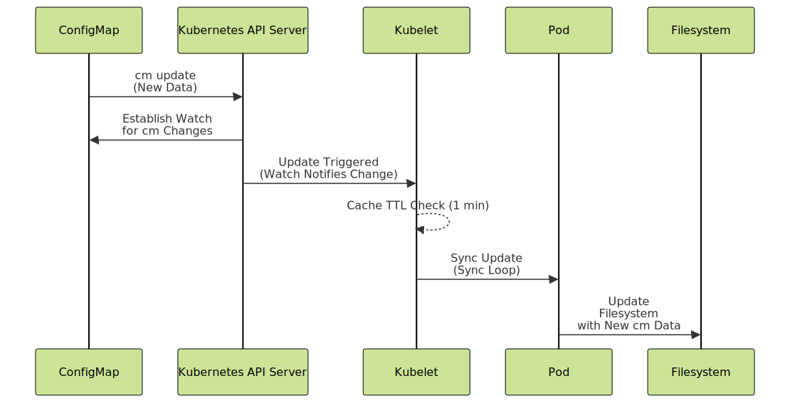

---
myst:
  html_meta:
    "description lang=en": "This detailed guide explains how Kubernetes handles dynamic updates to ConfigMaps using symlinks and kubelet. Learn how ConfigMaps work, including differences between mounting as volumes, environment variables, and subPath mounts, and how Kubernetes automatically updates ConfigMap data in real-time without requiring pod restarts. Perfect for Kubernetes users looking to optimize configuration management and understand kubelet’s role in managing ConfigMap updates."
    "keywords": "Kubernetes ConfigMap updates, Kubernetes symlink management, kubelet ConfigMap handling, ConfigMap volume mount, Kubernetes dynamic updates, ConfigMap environment variables, ConfigMap subPath mount, Kubernetes configuration management, ConfigMap real-time updates, kubelet role in Kubernetes"
    "property=og:locale": "en_US"
    "property=og:image": "https://raw.githubusercontent.com/colossus06/PodLock-Blog/main/og/symlink.png"
---


(symlink)=
# Atomic ConfigMap Updates in Kubernetes: How Symlinks and Kubelet Make It Happen

TL;DR *If you mount a ConfigMap as a volume, Kubernetes automatically updates the file system when the ConfigMap changes. However, if you're using environment variables or subPath mounts, updates aren't reflected unless the pod is restarted.*

When working with Kubernetes and ConfigMaps, one thing becomes immediately apparent: ConfigMaps are a flexible way to inject configurations into your application without rebuilding your container images. The key takeaway here is that the behavior of ConfigMaps, especially in terms of updates, depends entirely on how they are mounted and how Kubernetes manages those updates. This becomes critical when you need real-time updates for applications running in a Kubernetes cluster.
ConfigMaps aren’t encrypted and are not designed to store sensitive information. They are purely a way to inject configuration data into your application, keeping it separate from the container image.
So, how do you consume these ConfigMaps in your applications? Kubernetes provides a few options for using ConfigMaps, which include:
* Injecting them as environment variables.
* Passing them as command-line arguments.
* Mounting them as files in a volume within the container's filesystem.
## Consuming ConfigMaps in Pods
When a pod is created that consumes a ConfigMap (either as environment variables or mounted volumes), the pod's specification includes references to the ConfigMap. You can see these references in the pod's YAML definition under `spec.volumes[]` for volumes and `spec.containers[].env[]` for environment variables.
Upon scheduling the pod to a node, the kubelet on that node retrieves the ConfigMap data from the API server to populate the environment variables or mount the ConfigMap as a volume.
If the ConfigMap is mounted as a volume, the kubelet sets up the volume by creating a directory structure in the pod's file system where the ConfigMap data will reside.
The kubelet then establishes a watch connection with the Kubernetes API server for each ConfigMap or Secret used by the pods on its node. When the ConfigMap or Secret is updated, the API server notifies the kubelet through this connection.
## ConfigMap as Environment Variables
When you mount a ConfigMap as environment variables, the pod starts with the values present in the ConfigMap at the time of pod creation. However, updates to the ConfigMap do not propagate to the pod's environment variables unless the pod is restarted.
You can create a configmap with the following command:
```bash
kubectl create configmap demo-config --from-literal=example.key="Initial Value"
```
Then, mount it in an nginx pod:
```yaml
env:
- name: EXAMPLE_KEY
  valueFrom:
    configMapKeyRef:
      name: demo-config
      key: example.key
```
If you want to verify the environment variable injection:
```bash
kubectl exec <one-of-the-pods> -- env | grep EXAMPLE_KEY
```
You’ll see:
```bash
EXAMPLE_KEY=Initial Value
```
Now, let’s update the ConfigMap:
```bash
kubectl patch configmap demo-config -p '{"data":{"example.key":"First Update:env variables"}}'
```
If you recheck the environment variable, it still shows the `Initial Value`. This is because the pod doesn’t dynamically pick up changes to the ConfigMap. Environment variables are fixed for the pod's lifetime: to update the environment variables, you need to restart the pod.
If you're using a Deployment, you can delete the pods manually, and the ReplicaSet controller will automatically recreate them:
```yaml
33s Normal SuccessfulDelete ReplicaSet/nginx-5cd5c97db5 Deleted pod: nginx-5cd5c97db5-kkvgn # initial pod 1
33s Normal SuccessfulCreate ReplicaSet/nginx-bd485bdfc Created pod: nginx-bd485bdfc-lzfsg
33s Normal Killing Pod/nginx-5cd5c97db5-kkvgn Stopping container nginx
31s Normal Pulled Pod/nginx-bd485bdfc-lzfsg Successfully pulled image "bitnami/nginx" in 1.773s (1.773s including waiting). Image size: 184551081 bytes.
31s Normal Created Pod/nginx-bd485bdfc-lzfsg Created container nginx
31s Normal Started Pod/nginx-bd485bdfc-lzfsg Started container nginx
30s Normal SuccessfulDelete ReplicaSet/nginx-5cd5c97db5 Deleted pod: nginx-5cd5c97db5-4fw9t # initial pod 2
...
```
Alternatively, you can perform a rolling restart of the Deployment using the following command and check the configmap value:
```bash
kubectl rollout restart deployment nginx
#kubectl exec nginx-8dff55589-hqnb4 -- env | grep EXAMPLE_KEY
EXAMPLE_KEY=First Update:env variables
```
## Mounting a ConfigMap as a Regular Volume
Unlike environment variables or `subPath` mounts, which don't reflect updates without restarting the pod, mounting a `ConfigMap` as a volume in Kubernetes allows for dynamic updates. This means any changes to the `ConfigMap` are automatically applied to the pod without needing restarts or manual intervention.


The kubelet manages the lifecycle of pods on each node.
If you mount the `config-volume` ConfigMap to the `/etc/config` directory in your pod, your deployment YAML might look like this:
```yaml
  volumeMounts:
  - name: config-volume
    mountPath: /etc/config
volumes:
- name: config-volume
  configMap:
  name: demo-config
```
If you add this `ConfigMap` volume mount request to the deployment manifest, the kubelet performs several actions. We'll take a quick look at them in the following three sections:
### Fetching the ConfigMap data from the Kubernetes API
kubelet constantly monitors specific paths and resources it's interested in. Watches typically have a timeout after which they close automatically, and a new watch is established.
You can log these watch close notifications if you start a minikube cluster with higher verbosity and ssh into it:
```bash
journalctl -u kubelet | grep 'Watch'
Oct 02 12:17:21 minikube kubelet[2451]: I1002 12:17:21.444106 2451 apiserver.go:52] "Watching apiserver"
Oct 02 12:23:23 minikube kubelet[2451]: I1002 12:23:23.536954 2451 reflector.go:808] object-"kube-system"/"kube-root-ca.crt": Watch close - *v1.ConfigMap total 8 items received
Oct 02 12:23:25 minikube kubelet[2451]: I1002 12:23:25.463764 2451 reflector.go:808] k8s.io/client-go/informers/factory.go:160: Watch close - *v1.CSIDriver total 8 items received
Oct 02 12:24:19 minikube kubelet[2451]: I1002 12:24:19.474887 2451 reflector.go:808] k8s.io/client-go/informers/factory.go:160: Watch close - *v1.RuntimeClass total 8 items received
Oct 02 12:24:32 minikube kubelet[2451]: I1002 12:24:32.208463 2451 reflector.go:808] object-"kube-system"/"kube-proxy": Watch close - *v1.ConfigMap total 7 items received
Oct 02 12:25:09 minikube kubelet[2451]: I1002 12:25:09.357705 2451 reflector.go:808] object-"kube-system"/"coredns": Watch close - *v1.ConfigMap total 8 items received
```
When a pod mounts a ConfigMap as a volume, the kubelet first fetches the ConfigMap data from the Kubernetes API.
If you ssh into a minikube node and check kubelet logs:
```bash
journalctl -u kubelet | grep -i "Received"
#example output
Oct 02 12:53:30 minikube kubelet[2451]: I1002 12:53:30.557615 2451 configmap.go:211] Received configMap default/demo-config containing (1) pieces of data, 26 total bytes
...
```
You can manually verify the byte size. First, view the ConfigMap content with:
```bash
kubectl get configmap demo-config -o yaml
#example output
data:
example.key: First Update:env variables
...
```
Each character (including spaces) is typically 1 byte in most text encodings like UTF-8. It's obvious already but let's calculate it:
```bash
echo -n "First Update:env variables" | wc -c
26
```
You'll see the string's length in bytes matches the total number of bytes in the kubelet logs.
### Translating the data and storing in a node local directory
After retrieving the ConfigMap, kubelet translates the key-value pairs from the ConfigMap into actual files that it stores in a local directory. Each key in the ConfigMap becomes a file, and the corresponding value becomes the file's contents.
If you pick either of the pod id:
```bash
kubectl get pod <pod-name> -n <namespace> -o jsonpath='{.metadata.uid}'
# example output
721a7048-bd0e-4a74-96e3-12f425f9d38e
```
Then SSH into the node and check the contents of the pod's volumes directory:
```bash
minikube ssh
sudo ls /var/lib/kubelet/pods/721a7048-bd0e-4a74-96e3-12f425f9d38e/volumes/kubernetes.io~configmap/
# example output
config-volume
# ls config-volume
example.key
```

If you check the current value from the mounted `ConfigMap`:
```bash
# k exec <nginx-pod-name> -- cat /etc/config/example.key
First Update:env variables
```
You'll get one file named `example.key` in the `/etc/config/` directory and its value will be the last patch we made: `First Update:env variables`.
### Mounting the volume into the pod's filesystem
Finally, kubelet mounts the volume into the pod's filesystem at the path specified in the pod's manifest.
If you inspect the pod's filesystem:
```bash
kubectl exec -it <pod-name> -- sh
ls -la /etc/config
# example output
drwxr-xr-x 2 root root 4096 Sep 25 17:58 ..2024_09_25_17_58_43.3550472942
lrwxrwxrwx 1 root root 32 Sep 25 17:58 ..data -> ..2024_09_25_17_58_43.3550472942
lrwxrwxrwx 1 root root 18 Sep 25 17:50 example.key -> ..data/example.key
```
You should see the files and symbolic links created from the ConfigMap data which means the volume has been mounted successfully.
## Updating ConfigMaps and symlink switch
A symlink (symbolic link) is a file system pointer that references another file or directory. You may think of it as a shortcut. It doesn’t contain the actual data but points to where the data is located. The applications running in the pods accesses the ConfigMap through this symlink.
When kubelet mounts a ConfigMap as a volume in a pod, it sets up two levels of symlinks:
* The file you access in the pod (`/etc/config/example.key`) pointing to `..data/example.key`.
* and the `..data` directory pointing to the latest timestamped directory that holds the actual ConfigMap data.
When the ConfigMap is updated, kubelet doesn't modify the file directly: creates a new directory with the updated files and changes the `..data` symlink to point to this directory.
If you patch the `ConfigMap` once again with the following command:
```bash
kubectl patch configmap demo-config -p '{"data":{"example.key":"Now, Second update for symlinks"}}'
```
If you recheck the directory structure:
```bash
# ls -la
drwxr-xr-x 2 root root 4096 Sep 25 18:09 ..2024_09_25_18_09_31.1466192921
lrwxrwxrwx 1 root root 32 Sep 25 18:09 ..data -> ..2024_09_25_18_09_31.1466192921
lrwxrwxrwx 1 root root 18 Sep 25 17:50 example.key -> ..data/example.key
```
You'll see the `..data` symlink now points to (`2024_09_25_18_09_31.1466192921`). The application continues to use the old version until kubelet switches the symlink.



Symlink switch is an atomic operation managed by the kubelet as part of its volume reconciliation process.
If you recheck the kubelet logs and compare the bytes manually:
```bash
Oct 02 13:07:11 minikube kubelet[2451]: I1002 13:07:11.492226 2451 configmap.go:211] Received configMap default/demo-config containing (1) pieces of data, 26 total bytes
Oct 02 13:07:28 minikube kubelet[2451]: I1002 13:07:28.495492 2451 configmap.go:211] Received configMap default/demo-config containing (1) pieces of data, 31 total bytes
kubectl get configmap demo-config -o yaml
echo -n "Now, Second update for symlinks" | wc -c
#example output
31
```
You verify this number matches with kubelet logs.
## Kubelet Sync and Caching Behavior
The kubelet uses a sync loop to keep each node in your Kubernetes cluster in line with your desired state. By default, this loop runs once every minute. During each cycle, kubelet handles tasks like starting or stopping pods, mounting or unmounting volumes, updating symbolic links, and performing routine maintenance.

To manage ConfigMaps efficiently, the kubelet caches them in memory with a one-minute default Time-To-Live (TTL). If your application requests a ConfigMap within this minute, the kubelet serves it from the cache, which helps reduce unnecessary calls to the API server. Once the TTL expires, the kubelet fetches the latest version of the ConfigMap from the API server in the next sync cycle.

There are three strategies the kubelet can use to detect changes to ConfigMaps :
* Watch (Default): The kubelet watches the Kubernetes API server for any changes to ConfigMaps and Secrets.
* Cache: Here, kubelet relies solely on its local cache, which refreshes based on the TTL.
* Get: kubelet fetch the latest ConfigMap or Secret from the API server every time it runs the sync loop.

The speed at which an updated ConfigMap appears in your pod depends on two main factors: Kubelet Sync Period (`syncFrequency`) and ConfigMap Cache TTL (`configMapAndSecretChangeDetectionStrategy`).
You can adjust the sync behavior to better suit your application’s needs tweaking the `syncFrequency`.

In the worst-case scenario, an updated ConfigMap might take up to two minutes to show up in your pod. This means that if you update a ConfigMap right after a sync cycle, your pod may not see the change until both the sync loop and cache TTL have passed.



## Application Awareness and Key Takeaways
While ConfigMaps can dynamically update mounted files, not all applications handle these updates smoothly. Some applications only load their configuration during startup, which means they won’t recognize changes unless you manually refresh them, such as by sending a SIGHUP signal. Others use file watchers to detect changes in real-time. This works well for applications designed to handle configuration changes on the fly. However, if the app isn’t built for this, you must manage manual reloads or rely on complete pod restarts.

Even applications capable of dynamic reloads face another challenge: asynchronous propagation of ConfigMap updates across pods. Not all pods may receive the update simultaneously. The default sync delay (up to two minutes) might be acceptable for non-critical systems. Still, such delays might cause cascading failures in production environments if a wrong configuration spreads unevenly.

Tools like Stakater Reloader can help manage this risk. For example, Reloader monitors ConfigMaps and triggers rolling restarts of pods whenever a configuration change is detected. 

Alternatively, Kustomize configMapGenerator allows you to quickly revert to a previous ConfigMap version using an earlier configuration. 
You can also trigger immediate refreshes by updating a pod’s annotations. This forces the pod to recognize that something has changed and prompts Kubernetes to refresh or restart the pod right away.

* Mounting Strategy Matters. If you mount a ConfigMap as a volume, Kubernetes automatically updates the file system when the ConfigMap changes. However, if you're using environment variables or subPath mounts, updates aren't reflected unless the pod is restarted.
* When updating ConfigMaps mounted as volumes, you always have a reliable view of configuration data before or after an update.
* To project the new keys immediately, you can simply update one of the pod's annotations.
* With the Watch strategy set as default, Kubernetes strikes a good balance between timely updates and system performance.
* Although ConfigMaps supports dynamic updates, you might also need native or third-party tools for more control and safety.
## Final Words
If you still need to figure out why we're using config maps, see the twelve-factor app in the references section.
Choosing the right way to mount ConfigMaps depends on your configuration needs.
If you need environment variables or static files that won't change during the pod's lifecycle, mounting as an environment variable or using `subPath` works fine. However, if you need dynamic configuration updates, mounting the ConfigMap as a volume helps your application react to changes in real-time without pod restarts.

Enjoyed this read?
If you found this guide helpful, folow me for more on:
- [LinkedIn](https://www.linkedin.com/in/gulcantopcu/) to get the latest updates.
- [Medium](https://medium.com/@gulcantopcu) for even more Kubernetes insights and discussions.
- [Kuberada](https://kuberada.devtechops.dev/index.html), for in-depth articles.
### References
* [ConfigMaps Documentation](https://kubernetes.io/docs/concepts/configuration/configmap/)
* [Minikube Documentation](https://minikube.sigs.k8s.io/docs/)
* [etcdctl Tool Install](https://etcd.io/docs/v3.6/install/)
* [Kubelet Configuration](https://kubernetes.io/docs/reference/config-api/kubelet-config.v1beta1/)
* [Twelve-Factor App Methodology](https://12factor.net/config)
* [Stakater Reloader GitHub](https://github.com/stakater/Reloader)
* [Kustomize Documentation](https://kustomize.io/)
* [External Secrets Operator](https://external-secrets.io/)
* [Helm Documentation](https://helm.sh/docs/)


